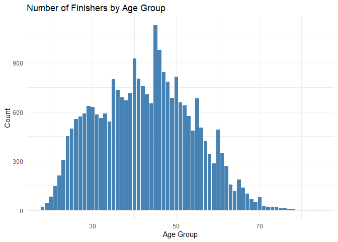
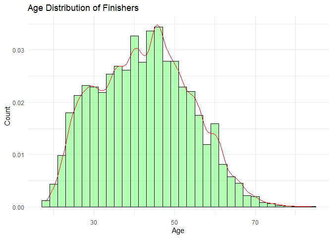
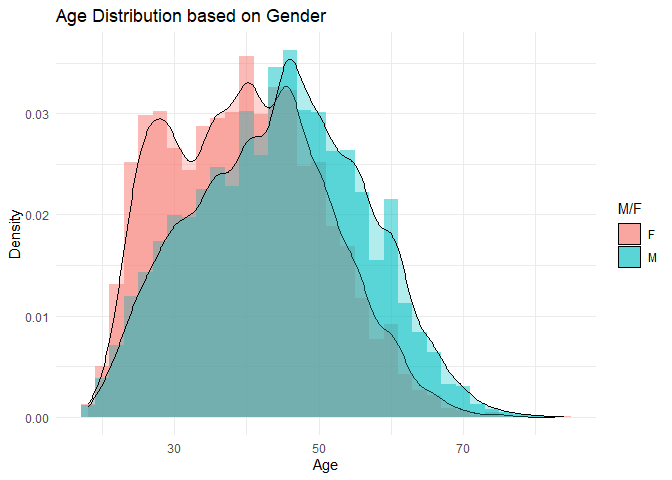
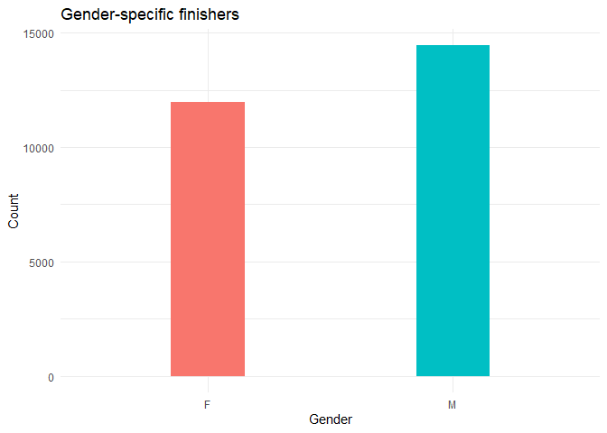
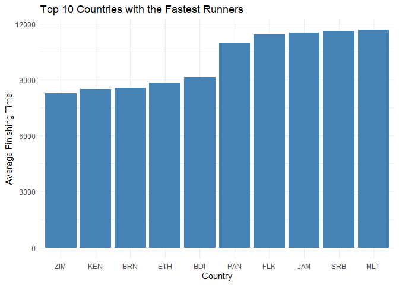

# Mini Project 1 - Marathon Results
This project aims to analyze marathon data from the year 2017. The dataset used for analysis is "marathon_results_2017.csv." The main objectives of this project are to:

1. Analyze the number of finishers by age group.
2. Visualize the age distribution of finishers.
3. Investigate the age distribution based on gender.
4. Determine the top 10 countries with the fastest runners based on average finishing time.

## Data Loading
The project starts by loading the necessary libraries, including tidyverse and ggplot2. These libraries provide functions for data manipulation and visualization, respectively. The marathon data is then loaded using the read_csv function from the tidyverse library.


```r
#Load libraries
library(tidyverse)
library(ggplot2)
```


```r
# Load data
marathon_data <- read_csv("D:/Masters/Sem3/Mini Project 1/data/marathon_results_2017.csv")
head(marathon_data)
```

```
## # A tibble: 6 × 22
##   Bib   Name     Age `M/F` City  State Country `5K`   `10K` `15K` `20K` Half    
##   <chr> <chr>  <dbl> <chr> <chr> <chr> <chr>   <time> <chr> <chr> <chr> <time>  
## 1 11    Kirui…    24 M     Keri… <NA>  KEN     15'25" 0:30… 0:45… 1:01… 01:04:35
## 2 17    Rupp,…    30 M     Port… OR    USA     15'24" 0:30… 0:45… 1:01… 01:04:35
## 3 23    Osako…    25 M     Mach… <NA>  JPN     15'25" 0:30… 0:45… 1:01… 01:04:36
## 4 21    Biwot…    32 M     Mamm… CA    USA     15'25" 0:30… 0:45… 1:01… 01:04:45
## 5 9     Chebe…    31 M     Mara… <NA>  KEN     15'25" 0:30… 0:45… 1:01… 01:04:35
## 6 15    Abdir…    40 M     Phoe… AZ    USA     15'25" 0:30… 0:45… 1:01… 01:04:35
## # ℹ 10 more variables: `25K` <time>, `30K` <time>, `35K` <time>, `40K` <time>,
## #   Pace <time>, `Proj Time` <chr>, `Official Time` <time>, Overall <dbl>,
## #   Gender <dbl>, Division <dbl>
```


```r
colnames(marathon_data)[4] <- "M_F"
colnames(marathon_data)[19] <- "Official_Time"
```


## Analysis and Visualization
### Number of Finishers by Age Group

The count of finishers is calculated for each age group. This information is then visualized using a bar plot.


```r
# calculate the count of finishers by age group
age_group_counts <- marathon_data %>%
  count(Age)

# Create a bar plot using ggplot
ggplot(age_group_counts, aes(x = Age, y = n)) +
  geom_bar(stat = "identity", fill = "steelblue") +
  labs(title = "Number of Finishers by Age Group",
       x = "Age Group",
       y = "Count") +
  theme_minimal()
```

<!-- -->

The bar plot showcasing the number of finishers by age group revealed that the highest number of finishers fell within the age group of 40-45, followed closely by the age group of 45-50. The number of finishers gradually increase with age until mid40's, then it starts gradually decreased with increasing age.

### Age Distribution of Finishers
To understand the age distribution of finishers, a histogram is created with density estimation.

```r
# Create a histogram to visualize the age distribution of finishers
ggplot(marathon_data, aes(x = Age)) +
  geom_histogram(aes(y = ..density..),
                 binwidth = 2, 
                 fill = "green", 
                 color = "black", 
                 alpha = 0.3) +
  geom_density(color = "red") +
  labs(title = "Age Distribution of Finishers",
       x = "Age",
       y = "Count") +
  theme_minimal()
```

```
## Warning: The dot-dot notation (`..density..`) was deprecated in ggplot2 3.4.0.
## ℹ Please use `after_stat(density)` instead.
## This warning is displayed once every 8 hours.
## Call `lifecycle::last_lifecycle_warnings()` to see where this warning was
## generated.
```

<!-- -->

The histogram depicting the age distribution of finishers indicated a relatively normal distribution with a peak in the mid-40s. This finding suggests that individuals in their mid-40s participate in marathons more frequently compared to other age groups.

### Age Distribution based on Gender
The age distribution is further analyzed based on gender by creating a histogram with density estimation and differentiating between male and female runners.


```r
# Create a histogram to visualize the age distribution based on gender
ggplot(marathon_data, aes(x = Age, fill = M_F)) +
  geom_histogram(aes(y = ..density..), binwidth = 2, position = "identity", alpha = 0.5 ) + 
  geom_density(alpha = 0.3) +
  labs(title = "Age Distribution based on Gender",
       x = "Age",
       y = "Density") +
  guides(fill=guide_legend(title="M/F")) +
  theme_minimal()
```

<!-- -->

The histogram comparing the age distribution based on gender highlighted interesting differences. Age distribution of Women finishers is on lower scale compared to men. Which means on an average women finishers have lower age compared to men.  

### Gender-specific Finishers
A pie chart is created to visualize the percentage of male and female finishers.


```r
gender_group_counts <- marathon_data %>%
  count(M_F)

#create bar chart
ggplot(gender_group_counts, aes(x=M_F, y=n, fill=M_F) ) +
  geom_bar(stat="identity", show.legend = FALSE, width = 0.3) +
  labs(title = "Gender-specific finishers", x = "Gender", y = "Count" ) +
  theme_minimal()
```

<!-- -->


The pie chart illustrated the gender-specific distribution of finishers. It revealed that there is no much difference in the male and female participants. However, the majority of marathon finishers were male, accounting for approximately 55% of the total finishers, while female participants constituted around 45%.
 
 
### Top 10 Countries with the Fastest Runners
The data is grouped by country, and the average finishing time is calculated for each country. The top 10 countries with the fastest runners, based on average finishing time, are selected and visualized using a bar plot.


```r
# Group the data by country and calculate the average finishing time for each country
country_avg_time <- marathon_data %>%
  group_by(Country) %>%
  summarise(Avg_Time = mean(Official_Time))

# Sort the countries based on the average finishing time in ascending order
sorted_countries <- country_avg_time %>%
  arrange(Avg_Time)

# Select the top 10 countries with the fastest runners
top_10_countries <- head(sorted_countries, 10)

# Create a bar plot for the top 10 countries with the fastest runners
ggplot(top_10_countries, aes(x = reorder(Country, Avg_Time) , y = Avg_Time )) +
  geom_bar(stat = "identity", fill = "steelblue") +
  labs(title = "Top 10 Countries with the Fastest Runners",
       x = "Country",
       y = "Average Finishing Time") +
  theme(axis.text.x = element_text(angle = 45, hjust = 1))+
  theme_minimal()
```

<!-- -->


The analysis of average finishing times for each country allowed us to identify the top 10 countries with the fastest runners. Among them, ZIM (Zimbabwe), KEN (Kenya), BRN (Brunei), and ETH (Ethiopia) stood out as leading countries in terms of marathon performance, with only minor differences distinguishing them. Notably, ZIM (Zimbabwe) emerged as the country with the fastest runners.

# Conclusion

This project report presented an analysis of marathon data from the year 2017. The analysis included exploring the number of finishers by age group, visualizing the age distribution of finishers, investigating the age distribution based on gender, and determining the top 10 countries with the fastest runners based on average finishing time. The visualizations provided insights into the demographics and performance of marathon runners, allowing for a better understanding of the dataset.

## Github link:
https://github.com/MownikaKonamaneni/Dataviz_mini_project1.git


