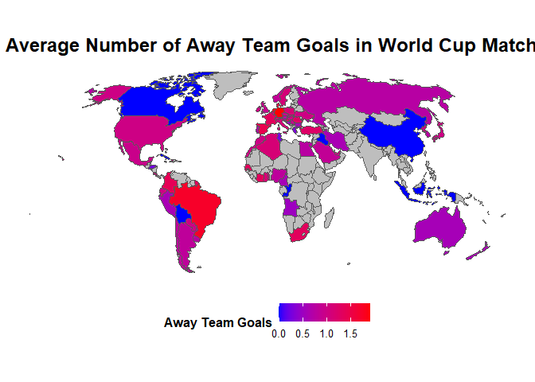
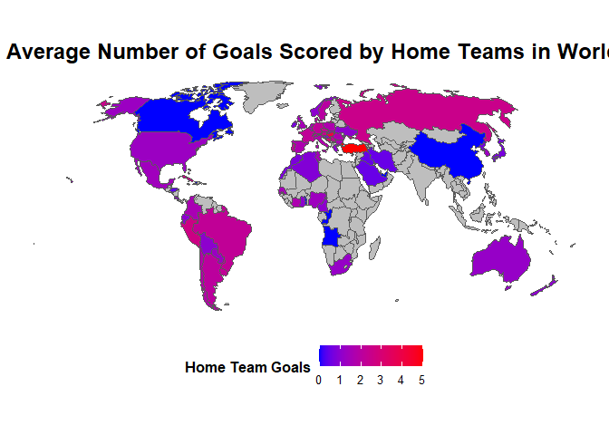
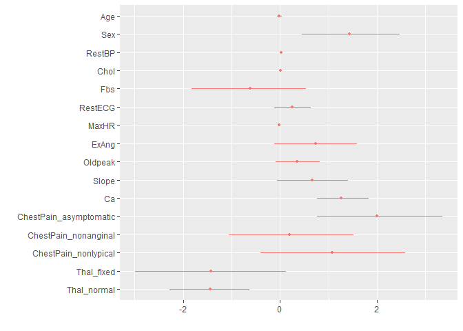
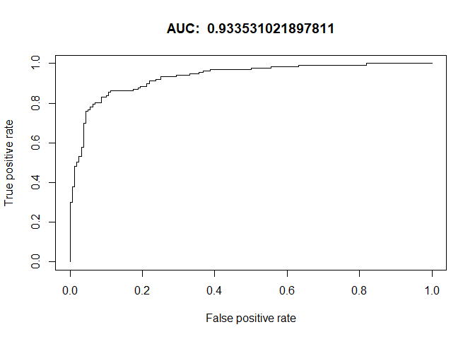

# Data Visualization - Mini Project 2

This project is aims to:

* Analyze the World cup matches data from 1930 to 2014. The dataset used for analysis is "WorldCupMatches.csv".

* Visualization of Model fitting on Heart disease diagnostic data and its coefficient plot.

The main objective of this projects are to:

1. Visualize the average number of goals scored by the away team and the home team on maps.
2. Analyze the number of matches won by the home team and the away team as the outcome of the match.
3. Determine the total number of goals scored in each match.
4. Analyze the heart disease prediction dataset.
5. Fit a model to the heart disease data and determine its coefficients and metrics. 


## Data Loading
The project starts by loading the necessary libraries. These libraries provide functions for data manipulation and visualization, respectively. 


```r
# Load libraries
library(tidyverse)
library(lubridate)
library(sf)
library(data.table)
library(fastDummies)
library(dotwhisker)
library(ROCR)
library(plotly)
```


```r
#Load the data

worldcup_matches <- read_csv("D:/Masters/Github/dataviz_final_project/project-02/data/WorldCupMatches.csv")

str(worldcup_matches)
```

```
## spc_tbl_ [4,572 × 20] (S3: spec_tbl_df/tbl_df/tbl/data.frame)
##  $ Year                : num [1:4572] 1930 1930 1930 1930 1930 1930 1930 1930 1930 1930 ...
##  $ Datetime            : chr [1:4572] "13 Jul 1930 - 15:00" "13 Jul 1930 - 15:00" "14 Jul 1930 - 12:45" "14 Jul 1930 - 14:50" ...
##  $ Stage               : chr [1:4572] "Group 1" "Group 4" "Group 2" "Group 3" ...
##  $ Stadium             : chr [1:4572] "Pocitos" "Parque Central" "Parque Central" "Pocitos" ...
##  $ City                : chr [1:4572] "Montevideo" "Montevideo" "Montevideo" "Montevideo" ...
##  $ Home Team Name      : chr [1:4572] "France" "USA" "Yugoslavia" "Romania" ...
##  $ Home Team Goals     : num [1:4572] 4 3 2 3 1 3 4 3 1 1 ...
##  $ Away Team Goals     : num [1:4572] 1 0 1 1 0 0 0 0 0 0 ...
##  $ Away Team Name      : chr [1:4572] "Mexico" "Belgium" "Brazil" "Peru" ...
##  $ Win conditions      : chr [1:4572] NA NA NA NA ...
##  $ Attendance          : num [1:4572] 4444 18346 24059 2549 23409 ...
##  $ Half-time Home Goals: num [1:4572] 3 2 2 1 0 1 0 2 0 0 ...
##  $ Half-time Away Goals: num [1:4572] 0 0 0 0 0 0 0 0 0 0 ...
##  $ Referee             : chr [1:4572] "LOMBARDI Domingo (URU)" "MACIAS Jose (ARG)" "TEJADA Anibal (URU)" "WARNKEN Alberto (CHI)" ...
##  $ Assistant 1         : chr [1:4572] "CRISTOPHE Henry (BEL)" "MATEUCCI Francisco (URU)" "VALLARINO Ricardo (URU)" "LANGENUS Jean (BEL)" ...
##  $ Assistant 2         : chr [1:4572] "REGO Gilberto (BRA)" "WARNKEN Alberto (CHI)" "BALWAY Thomas (FRA)" "MATEUCCI Francisco (URU)" ...
##  $ RoundID             : num [1:4572] 201 201 201 201 201 201 201 201 201 201 ...
##  $ MatchID             : num [1:4572] 1096 1090 1093 1098 1085 ...
##  $ Home Team Initials  : chr [1:4572] "FRA" "USA" "YUG" "ROU" ...
##  $ Away Team Initials  : chr [1:4572] "MEX" "BEL" "BRA" "PER" ...
##  - attr(*, "spec")=
##   .. cols(
##   ..   Year = col_double(),
##   ..   Datetime = col_character(),
##   ..   Stage = col_character(),
##   ..   Stadium = col_character(),
##   ..   City = col_character(),
##   ..   `Home Team Name` = col_character(),
##   ..   `Home Team Goals` = col_double(),
##   ..   `Away Team Goals` = col_double(),
##   ..   `Away Team Name` = col_character(),
##   ..   `Win conditions` = col_character(),
##   ..   Attendance = col_double(),
##   ..   `Half-time Home Goals` = col_double(),
##   ..   `Half-time Away Goals` = col_double(),
##   ..   Referee = col_character(),
##   ..   `Assistant 1` = col_character(),
##   ..   `Assistant 2` = col_character(),
##   ..   RoundID = col_double(),
##   ..   MatchID = col_double(),
##   ..   `Home Team Initials` = col_character(),
##   ..   `Away Team Initials` = col_character()
##   .. )
##  - attr(*, "problems")=<externalptr>
```

## Data cleaning and processing

The data cleaning and processing steps include the following:


```r
source("D:/Masters/Github/dataviz_final_project/project-02/Data_transformation.R")
```


```r
# Calculate summary statistics
summary(worldcup_matches$home_team_goals)
```

```
##    Min. 1st Qu.  Median    Mean 3rd Qu.    Max. 
##   0.000   1.000   2.000   1.811   3.000  10.000
```

```r
summary(worldcup_matches$away_team_goals)
```

```
##    Min. 1st Qu.  Median    Mean 3rd Qu.    Max. 
##   0.000   0.000   1.000   1.022   2.000   7.000
```

From above summary statistics we can determine that maximum number of goals scored by home team are 10 and Away team scored 7.   


### Visualization of Average number of Away team goals and Home team goals in Maps 

The average number of goals scored by the away team is visualized on a map using the world shapefile data from [Natural Earth](https://www.naturalearthdata.com/).
The "average_goals" variable calculated from the World Cup matches data by aggregating the home team and away team goals based on the country and marked them on map by grouping with country.

```r
world_shapes <- read_sf("D:/Masters/Github/dataviz_final_project/project-02/data/ne_110m_admin_0_countries/ne_110m_admin_0_countries.shp")

worldcup_away_goals <- worldcup_matches  %>% group_by(away_country) %>%summarise(average_goals = mean(away_team_goals))

away_spatial_data <- world_shapes %>%
  left_join(worldcup_away_goals, by = c("ADMIN" = "away_country")) %>%
  filter(ISO_A3 != "ATA") 


# Plot the map
ggplot(away_spatial_data, aes(group = ADMIN)) +
  geom_sf(aes(fill = average_goals)) +
  coord_sf(crs = "+proj=robin") +
  scale_fill_gradient(low = "blue", high = "red", na.value = "gray", name = "Away Team Goals") +
  ggtitle("Average Number of Away Team Goals in World Cup Matches") +
  theme_minimal() +
  theme(plot.title = element_text(size = 18, face = "bold"),
        legend.title = element_text(size = 12, face = "bold"),
        legend.text = element_text(size = 10),
        legend.position = "bottom",
        panel.grid = element_blank(),
        axis.text = element_blank(),
        axis.title = element_blank())
```

<!-- -->

From the above map we can see that Germany scored highest avaerage number of goals in the worldcup matches followed by Netherlands and Brazil. 


```r
worldcup_home_goals <- worldcup_matches  %>% group_by(home_country) %>%summarise(average_goals = mean(home_team_goals))


home_spatial_data <- world_shapes %>%
  left_join(worldcup_home_goals, by = c("ADMIN" = "home_country")) %>%
  filter(ISO_A3 != "ATA") 


# Plot the map
 ggplot(home_spatial_data, aes(group = ADMIN)) +
  geom_sf(aes(fill = average_goals)) +
   coord_sf(crs = "+proj=robin") +
  scale_fill_gradient(low = "blue", high = "red", na.value = "gray", name = "Home Team Goals") +
  labs(title = "Average Number of Goals Scored by Home Teams in World Cup Matches") +
  theme_minimal() +
  theme(plot.title = element_text(size = 18, face = "bold"),
        legend.title = element_text(size = 12, face = "bold"),
        legend.text = element_text(size = 10),
        legend.position = "bottom",
        panel.grid = element_blank(),
        axis.text = element_blank(),
        axis.title = element_blank())
```

<!-- -->

From the above map we can see that Turkey scored highest avaerage number of goals in the worldcup matches followed by Hungary.

Analyze the number of matches won by Home team and Away team as outcome of the match


```r
# Bar chart of match outcome
b <- ggplot(worldcup_matches, aes(x = outcome, fill = outcome)) +
  geom_bar( width = 0.3) +
  labs(title = "Match Outcome",
       x = "Outcome", y = "Count") +
  scale_fill_manual(values = c("Home Team Win" = "steelblue", "Away Team Win" = "salmon")) 

ggplotly(b)  
```

```{=html}
<div class="plotly html-widget html-fill-item-overflow-hidden html-fill-item" id="htmlwidget-a6580c02d6f5a54ebb14" style="width:960px;height:480px;"></div>
<script type="application/json" data-for="htmlwidget-a6580c02d6f5a54ebb14">{"x":{"data":[{"orientation":"v","width":0.3,"base":0,"x":[1],"y":[364],"text":"count: 364<br />outcome: Away Team Win<br />outcome: Away Team Win","type":"bar","textposition":"none","marker":{"autocolorscale":false,"color":"rgba(250,128,114,1)","line":{"width":1.88976377952756,"color":"transparent"}},"name":"Away Team Win","legendgroup":"Away Team Win","showlegend":true,"xaxis":"x","yaxis":"y","hoverinfo":"text","frame":null},{"orientation":"v","width":0.3,"base":0,"x":[2],"y":[488],"text":"count: 488<br />outcome: Home Team Win<br />outcome: Home Team Win","type":"bar","textposition":"none","marker":{"autocolorscale":false,"color":"rgba(70,130,180,1)","line":{"width":1.88976377952756,"color":"transparent"}},"name":"Home Team Win","legendgroup":"Home Team Win","showlegend":true,"xaxis":"x","yaxis":"y","hoverinfo":"text","frame":null}],"layout":{"margin":{"t":48.1461187214612,"r":7.30593607305936,"b":44.5662100456621,"l":43.1050228310502},"plot_bgcolor":"rgba(235,235,235,1)","paper_bgcolor":"rgba(255,255,255,1)","font":{"color":"rgba(0,0,0,1)","family":"","size":14.6118721461187},"title":{"text":"Match Outcome","font":{"color":"rgba(0,0,0,1)","family":"","size":17.5342465753425},"x":0,"xref":"paper"},"xaxis":{"domain":[0,1],"automargin":true,"type":"linear","autorange":false,"range":[0.4,2.6],"tickmode":"array","ticktext":["Away Team Win","Home Team Win"],"tickvals":[1,2],"categoryorder":"array","categoryarray":["Away Team Win","Home Team Win"],"nticks":null,"ticks":"outside","tickcolor":"rgba(51,51,51,1)","ticklen":3.65296803652968,"tickwidth":0.66417600664176,"showticklabels":true,"tickfont":{"color":"rgba(77,77,77,1)","family":"","size":11.689497716895},"tickangle":-0,"showline":false,"linecolor":null,"linewidth":0,"showgrid":true,"gridcolor":"rgba(255,255,255,1)","gridwidth":0.66417600664176,"zeroline":false,"anchor":"y","title":{"text":"Outcome","font":{"color":"rgba(0,0,0,1)","family":"","size":14.6118721461187}},"hoverformat":".2f"},"yaxis":{"domain":[0,1],"automargin":true,"type":"linear","autorange":false,"range":[-24.4,512.4],"tickmode":"array","ticktext":["0","100","200","300","400","500"],"tickvals":[0,100,200,300,400,500],"categoryorder":"array","categoryarray":["0","100","200","300","400","500"],"nticks":null,"ticks":"outside","tickcolor":"rgba(51,51,51,1)","ticklen":3.65296803652968,"tickwidth":0.66417600664176,"showticklabels":true,"tickfont":{"color":"rgba(77,77,77,1)","family":"","size":11.689497716895},"tickangle":-0,"showline":false,"linecolor":null,"linewidth":0,"showgrid":true,"gridcolor":"rgba(255,255,255,1)","gridwidth":0.66417600664176,"zeroline":false,"anchor":"x","title":{"text":"Count","font":{"color":"rgba(0,0,0,1)","family":"","size":14.6118721461187}},"hoverformat":".2f"},"shapes":[{"type":"rect","fillcolor":null,"line":{"color":null,"width":0,"linetype":[]},"yref":"paper","xref":"paper","x0":0,"x1":1,"y0":0,"y1":1}],"showlegend":true,"legend":{"bgcolor":"rgba(255,255,255,1)","bordercolor":"transparent","borderwidth":1.88976377952756,"font":{"color":"rgba(0,0,0,1)","family":"","size":11.689497716895},"title":{"text":"outcome","font":{"color":"rgba(0,0,0,1)","family":"","size":14.6118721461187}}},"hovermode":"closest","barmode":"relative"},"config":{"doubleClick":"reset","modeBarButtonsToAdd":["hoverclosest","hovercompare"],"showSendToCloud":false},"source":"A","attrs":{"2d2c3a025e17":{"x":{},"fill":{},"type":"bar"}},"cur_data":"2d2c3a025e17","visdat":{"2d2c3a025e17":["function (y) ","x"]},"highlight":{"on":"plotly_click","persistent":false,"dynamic":false,"selectize":false,"opacityDim":0.2,"selected":{"opacity":1},"debounce":0},"shinyEvents":["plotly_hover","plotly_click","plotly_selected","plotly_relayout","plotly_brushed","plotly_brushing","plotly_clickannotation","plotly_doubleclick","plotly_deselect","plotly_afterplot","plotly_sunburstclick"],"base_url":"https://plot.ly"},"evals":[],"jsHooks":[]}</script>
```
The total number of goals scored in each year from 1930 to 2014 is visualized using a bar chart. The chart depicts the trend of goals scored over time.

```r
# Create the bar chart
Goals_plot <- ggplot(worldcup_matches, aes(x = Year, y = Goals)) +
  geom_bar(stat = "identity", fill = "steelblue") +
  labs(title = "Total Goals Scored Every Year (1930-2014)",
       x = "Year", y = "Goals") +
  theme_minimal()

ggplotly(Goals_plot)
```

```{=html}
<div class="plotly html-widget html-fill-item-overflow-hidden html-fill-item" id="htmlwidget-425001138c91e6a8c047" style="width:960px;height:480px;"></div>
<script type="application/json" data-for="htmlwidget-425001138c91e6a8c047">{"x":{"data":[{"orientation":"v","width":[3.59999999999991,3.59999999999991,3.59999999999991,3.59999999999991,3.59999999999991,3.59999999999991,3.59999999999991,3.59999999999991,3.59999999999991,3.59999999999991,3.59999999999991,3.59999999999991,3.59999999999991,3.59999999999991,3.59999999999991,3.59999999999991,3.59999999999991,3.59999999999991,3.59999999999991,3.59999999999991,3.59999999999991,3.59999999999991,3.59999999999991,3.59999999999991,3.59999999999991,3.59999999999991,3.59999999999991,3.59999999999991,3.59999999999991,3.59999999999991,3.59999999999991,3.59999999999991,3.59999999999991,3.59999999999991,3.59999999999991,3.59999999999991,3.59999999999991,3.59999999999991,3.59999999999991,3.59999999999991,3.59999999999991,3.59999999999991,3.59999999999991,3.59999999999991,3.59999999999991,3.59999999999991,3.59999999999991,3.59999999999991,3.59999999999991,3.59999999999991,3.59999999999991,3.59999999999991,3.59999999999991,3.59999999999991,3.59999999999991,3.59999999999991,3.59999999999991,3.59999999999991,3.59999999999991,3.59999999999991,3.59999999999991,3.59999999999991,3.59999999999991,3.59999999999991,3.59999999999991,3.59999999999991,3.59999999999991,3.59999999999991,3.59999999999991,3.59999999999991,3.59999999999991,3.59999999999991,3.59999999999991,3.59999999999991,3.59999999999991,3.59999999999991,3.59999999999991,3.59999999999991,3.59999999999991,3.59999999999991,3.59999999999991,3.59999999999991,3.59999999999991,3.59999999999991,3.59999999999991,3.59999999999991,3.59999999999991,3.59999999999991,3.59999999999991,3.59999999999991,3.59999999999991,3.59999999999991,3.59999999999991,3.59999999999991,3.59999999999991,3.59999999999991,3.59999999999991,3.59999999999991,3.59999999999991,3.59999999999991,3.59999999999991,3.59999999999991,3.59999999999991,3.59999999999991,3.59999999999991,3.59999999999991,3.59999999999991,3.59999999999991,3.59999999999991,3.59999999999991,3.59999999999991,3.59999999999991,3.59999999999991,3.59999999999991,3.59999999999991,3.59999999999991,3.59999999999991,3.59999999999991,3.59999999999991,3.59999999999991,3.59999999999991,3.59999999999991,3.59999999999991,3.59999999999991,3.59999999999991,3.59999999999991,3.59999999999991,3.59999999999991,3.59999999999991,3.59999999999991,3.59999999999991,3.59999999999991,3.59999999999991,3.59999999999991,3.59999999999991,3.59999999999991,3.59999999999991,3.59999999999991,3.59999999999991,3.59999999999991,3.59999999999991,3.59999999999991,3.59999999999991,3.59999999999991,3.59999999999991,3.59999999999991,3.59999999999991,3.59999999999991,3.59999999999991,3.59999999999991,3.59999999999991,3.59999999999991,3.59999999999991,3.59999999999991,3.59999999999991,3.59999999999991,3.59999999999991,3.59999999999991,3.59999999999991,3.59999999999991,3.59999999999991,3.59999999999991,3.59999999999991,3.59999999999991,3.59999999999991,3.59999999999991,3.59999999999991,3.59999999999991,3.59999999999991,3.59999999999991,3.59999999999991,3.59999999999991,3.59999999999991,3.59999999999991,3.59999999999991,3.59999999999991,3.59999999999991,3.59999999999991,3.59999999999991,3.59999999999991,3.59999999999991,3.59999999999991,3.59999999999991,3.59999999999991,3.59999999999991,3.59999999999991,3.59999999999991,3.59999999999991,3.59999999999991,3.59999999999991,3.59999999999991,3.59999999999991,3.59999999999991,3.59999999999991,3.59999999999991,3.59999999999991,3.59999999999991,3.59999999999991,3.59999999999991,3.59999999999991,3.59999999999991,3.59999999999991,3.59999999999991,3.59999999999991,3.59999999999991,3.59999999999991,3.59999999999991,3.59999999999991,3.59999999999991,3.59999999999991,3.59999999999991,3.59999999999991,3.59999999999991,3.59999999999991,3.59999999999991,3.59999999999991,3.59999999999991,3.59999999999991,3.59999999999991,3.59999999999991,3.59999999999991,3.59999999999991,3.59999999999991,3.59999999999991,3.59999999999991,3.59999999999991,3.59999999999991,3.59999999999991,3.59999999999991,3.59999999999991,3.59999999999991,3.59999999999991,3.59999999999991,3.59999999999991,3.59999999999991,3.59999999999991,3.59999999999991,3.59999999999991,3.59999999999991,3.59999999999991,3.59999999999991,3.59999999999991,3.59999999999991,3.59999999999991,3.59999999999991,3.59999999999991,3.59999999999991,3.59999999999991,3.59999999999991,3.59999999999991,3.59999999999991,3.59999999999991,3.59999999999991,3.59999999999991,3.59999999999991,3.59999999999991,3.59999999999991,3.59999999999991,3.59999999999991,3.59999999999991,3.59999999999991,3.59999999999991,3.59999999999991,3.59999999999991,3.59999999999991,3.59999999999991,3.59999999999991,3.59999999999991,3.59999999999991,3.59999999999991,3.59999999999991,3.59999999999991,3.59999999999991,3.59999999999991,3.59999999999991,3.59999999999991,3.59999999999991,3.59999999999991,3.59999999999991,3.59999999999991,3.59999999999991,3.59999999999991,3.59999999999991,3.59999999999991,3.59999999999991,3.59999999999991,3.59999999999991,3.59999999999991,3.59999999999991,3.59999999999991,3.59999999999991,3.59999999999991,3.59999999999991,3.59999999999991,3.59999999999991,3.59999999999991,3.59999999999991,3.59999999999991,3.59999999999991,3.59999999999991,3.59999999999991,3.59999999999991,3.59999999999991,3.59999999999991,3.59999999999991,3.59999999999991,3.59999999999991,3.59999999999991,3.59999999999991,3.59999999999991,3.59999999999991,3.59999999999991,3.59999999999991,3.59999999999991,3.59999999999991,3.59999999999991,3.59999999999991,3.59999999999991,3.59999999999991,3.59999999999991,3.59999999999991,3.59999999999991,3.59999999999991,3.59999999999991,3.59999999999991,3.59999999999991,3.59999999999991,3.59999999999991,3.59999999999991,3.59999999999991,3.59999999999991,3.59999999999991,3.59999999999991,3.59999999999991,3.59999999999991,3.59999999999991,3.59999999999991,3.59999999999991,3.59999999999991,3.59999999999991,3.59999999999991,3.59999999999991,3.59999999999991,3.59999999999991,3.59999999999991,3.59999999999991,3.59999999999991,3.59999999999991,3.59999999999991,3.59999999999991,3.59999999999991,3.59999999999991,3.59999999999991,3.59999999999991,3.59999999999991,3.59999999999991,3.59999999999991,3.59999999999991,3.59999999999991,3.59999999999991,3.59999999999991,3.59999999999991,3.59999999999991,3.59999999999991,3.59999999999991,3.59999999999991,3.59999999999991,3.59999999999991,3.59999999999991,3.59999999999991,3.59999999999991,3.59999999999991,3.59999999999991,3.59999999999991,3.59999999999991,3.59999999999991,3.59999999999991,3.59999999999991,3.59999999999991,3.59999999999991,3.59999999999991,3.59999999999991,3.59999999999991,3.59999999999991,3.59999999999991,3.59999999999991,3.59999999999991,3.59999999999991,3.59999999999991,3.59999999999991,3.59999999999991,3.59999999999991,3.59999999999991,3.59999999999991,3.59999999999991,3.59999999999991,3.59999999999991,3.59999999999991,3.59999999999991,3.59999999999991,3.59999999999991,3.59999999999991,3.59999999999991,3.59999999999991,3.59999999999991,3.59999999999991,3.59999999999991,3.59999999999991,3.59999999999991,3.59999999999991,3.59999999999991,3.59999999999991,3.59999999999991,3.59999999999991,3.59999999999991,3.59999999999991,3.59999999999991,3.59999999999991,3.59999999999991,3.59999999999991,3.59999999999991,3.59999999999991,3.59999999999991,3.59999999999991,3.59999999999991,3.59999999999991,3.59999999999991,3.59999999999991,3.59999999999991,3.59999999999991,3.59999999999991,3.59999999999991,3.59999999999991,3.59999999999991,3.59999999999991,3.59999999999991,3.59999999999991,3.59999999999991,3.59999999999991,3.59999999999991,3.59999999999991,3.59999999999991,3.59999999999991,3.59999999999991,3.59999999999991,3.59999999999991,3.59999999999991,3.59999999999991,3.59999999999991,3.59999999999991,3.59999999999991,3.59999999999991,3.59999999999991,3.59999999999991,3.59999999999991,3.59999999999991,3.59999999999991,3.59999999999991,3.59999999999991,3.59999999999991,3.59999999999991,3.59999999999991,3.59999999999991,3.59999999999991,3.59999999999991,3.59999999999991,3.59999999999991,3.59999999999991,3.59999999999991,3.59999999999991,3.59999999999991,3.59999999999991,3.59999999999991,3.59999999999991,3.59999999999991,3.59999999999991,3.59999999999991,3.59999999999991,3.59999999999991,3.59999999999991,3.59999999999991,3.59999999999991,3.59999999999991,3.59999999999991,3.59999999999991,3.59999999999991,3.59999999999991,3.59999999999991,3.59999999999991,3.59999999999991,3.59999999999991,3.59999999999991,3.59999999999991,3.59999999999991,3.59999999999991,3.59999999999991,3.59999999999991,3.59999999999991,3.59999999999991,3.59999999999991,3.59999999999991,3.59999999999991,3.59999999999991,3.59999999999991,3.59999999999991,3.59999999999991,3.59999999999991,3.59999999999991,3.59999999999991,3.59999999999991,3.59999999999991,3.59999999999991,3.59999999999991,3.59999999999991,3.59999999999991,3.59999999999991,3.59999999999991,3.59999999999991,3.59999999999991,3.59999999999991,3.59999999999991,3.59999999999991,3.59999999999991,3.59999999999991,3.59999999999991,3.59999999999991,3.59999999999991,3.59999999999991,3.59999999999991,3.59999999999991,3.59999999999991,3.59999999999991,3.59999999999991,3.59999999999991,3.59999999999991,3.59999999999991,3.59999999999991,3.59999999999991,3.59999999999991,3.59999999999991,3.59999999999991,3.59999999999991,3.59999999999991,3.59999999999991,3.59999999999991,3.59999999999991,3.59999999999991,3.59999999999991,3.59999999999991,3.59999999999991,3.59999999999991,3.59999999999991,3.59999999999991,3.59999999999991,3.59999999999991,3.59999999999991,3.59999999999991,3.59999999999991,3.59999999999991,3.59999999999991,3.59999999999991,3.59999999999991,3.59999999999991,3.59999999999991,3.59999999999991,3.59999999999991,3.59999999999991,3.59999999999991,3.59999999999991,3.59999999999991,3.59999999999991,3.59999999999991,3.59999999999991,3.59999999999991,3.59999999999991,3.59999999999991,3.59999999999991,3.59999999999991,3.59999999999991,3.59999999999991,3.59999999999991,3.59999999999991,3.59999999999991,3.59999999999991,3.59999999999991,3.59999999999991,3.59999999999991,3.59999999999991,3.59999999999991,3.59999999999991,3.59999999999991,3.59999999999991,3.59999999999991,3.59999999999991,3.59999999999991,3.59999999999991,3.59999999999991,3.59999999999991,3.59999999999991,3.59999999999991,3.59999999999991,3.59999999999991,3.59999999999991,3.59999999999991,3.59999999999991,3.59999999999991,3.59999999999991,3.59999999999991,3.59999999999991,3.59999999999991,3.59999999999991,3.59999999999991,3.59999999999991,3.59999999999991,3.59999999999991,3.59999999999991,3.59999999999991,3.59999999999991,3.59999999999991,3.59999999999991,3.59999999999991,3.59999999999991,3.59999999999991,3.59999999999991,3.59999999999991,3.59999999999991,3.59999999999991,3.59999999999991,3.59999999999991,3.59999999999991,3.59999999999991,3.59999999999991,3.59999999999991,3.59999999999991,3.59999999999991,3.59999999999991,3.59999999999991,3.59999999999991,3.59999999999991,3.59999999999991,3.59999999999991,3.59999999999991,3.59999999999991,3.59999999999991,3.59999999999991,3.59999999999991,3.59999999999991,3.59999999999991,3.59999999999991,3.59999999999991,3.59999999999991,3.59999999999991,3.59999999999991,3.59999999999991,3.59999999999991,3.59999999999991,3.59999999999991,3.59999999999991,3.59999999999991,3.59999999999991,3.59999999999991,3.59999999999991,3.59999999999991,3.59999999999991,3.59999999999991,3.59999999999991,3.59999999999991,3.59999999999991,3.59999999999991,3.59999999999991,3.59999999999991,3.59999999999991,3.59999999999991,3.59999999999991,3.59999999999991,3.59999999999991,3.59999999999991,3.59999999999991,3.59999999999991,3.59999999999991,3.59999999999991,3.59999999999991,3.59999999999991,3.59999999999991,3.59999999999991,3.59999999999991,3.59999999999991,3.59999999999991,3.59999999999991,3.59999999999991,3.59999999999991,3.59999999999991,3.59999999999991,3.59999999999991,3.59999999999991,3.59999999999991,3.59999999999991,3.59999999999991,3.59999999999991,3.59999999999991,3.59999999999991,3.59999999999991,3.59999999999991,3.59999999999991,3.59999999999991,3.59999999999991,3.59999999999991,3.59999999999991,3.59999999999991,3.59999999999991,3.59999999999991,3.59999999999991,3.59999999999991,3.59999999999991,3.59999999999991,3.59999999999991,3.59999999999991,3.59999999999991,3.59999999999991,3.59999999999991,3.59999999999991,3.59999999999991,3.59999999999991,3.59999999999991,3.59999999999991,3.59999999999991,3.59999999999991,3.59999999999991,3.59999999999991,3.59999999999991,3.59999999999991,3.59999999999991,3.59999999999991,3.59999999999991,3.59999999999991,3.59999999999991,3.59999999999991,3.59999999999991,3.59999999999991,3.59999999999991,3.59999999999991,3.59999999999991,3.59999999999991,3.59999999999991,3.59999999999991,3.59999999999991,3.59999999999991,3.59999999999991,3.59999999999991,3.59999999999991,3.59999999999991,3.59999999999991,3.59999999999991,3.59999999999991,3.59999999999991,3.59999999999991,3.59999999999991,3.59999999999991,3.59999999999991,3.59999999999991,3.59999999999991,3.59999999999991,3.59999999999991,3.59999999999991,3.59999999999991,3.59999999999991,3.59999999999991,3.59999999999991,3.59999999999991,3.59999999999991,3.59999999999991,3.59999999999991,3.59999999999991,3.59999999999991,3.59999999999991,3.59999999999991,3.59999999999991,3.59999999999991,3.59999999999991,3.59999999999991,3.59999999999991,3.59999999999991,3.59999999999991,3.59999999999991,3.59999999999991,3.59999999999991,3.59999999999991,3.59999999999991,3.59999999999991,3.59999999999991,3.59999999999991,3.59999999999991,3.59999999999991,3.59999999999991,3.59999999999991,3.59999999999991,3.59999999999991,3.59999999999991,3.59999999999991,3.59999999999991,3.59999999999991,3.59999999999991,3.59999999999991,3.59999999999991,3.59999999999991,3.59999999999991,3.59999999999991,3.59999999999991,3.59999999999991,3.59999999999991,3.59999999999991,3.59999999999991,3.59999999999991,3.59999999999991,3.59999999999991,3.59999999999991,3.59999999999991,3.59999999999991,3.59999999999991,3.59999999999991,3.59999999999991,3.59999999999991,3.59999999999991,3.59999999999991,3.59999999999991,3.59999999999991,3.59999999999991,3.59999999999991,3.59999999999991,3.59999999999991,3.59999999999991,3.59999999999991,3.59999999999991,3.59999999999991,3.59999999999991,3.59999999999991,3.59999999999991,3.59999999999991,3.59999999999991,3.59999999999991,3.59999999999991,3.59999999999991,3.59999999999991,3.59999999999991,3.59999999999991,3.59999999999991,3.59999999999991,3.59999999999991,3.59999999999991,3.59999999999991,3.59999999999991,3.59999999999991],"base":[0,5,8,11,15,16,19,23,26,27,28,37,41,42,46,50,57,64,0,5,11,16,21,28,32,40,43,48,51,53,56,57,58,62,67,0,2,8,12,18,21,32,35,38,44,46,48,56,60,63,69,72,78,0,4,6,10,15,18,22,27,29,33,34,36,37,39,47,50,57,61,69,76,81,85,0,2,3,8,9,14,23,31,34,41,46,51,53,64,71,73,78,87,92,98,110,112,118,125,131,135,0,3,7,11,13,23,25,28,29,29,31,36,41,43,47,51,54,54,56,60,64,70,73,77,84,85,88,91,92,93,95,99,103,110,119,0,3,5,6,10,12,13,16,16,20,20,24,26,34,35,42,45,48,51,51,53,58,62,62,65,68,72,73,74,78,84,85,0,0,5,7,10,12,16,19,21,24,27,31,33,36,36,37,39,39,41,45,46,48,52,55,58,59,63,66,74,77,80,83,0,0,2,7,8,9,12,17,20,20,23,26,31,33,40,41,45,46,50,55,57,57,59,60,61,66,71,77,78,82,89,90,0,0,1,3,5,7,7,11,16,19,19,21,30,30,32,39,41,43,43,46,47,52,57,60,63,65,66,70,71,74,77,79,85,86,88,90,93,94,0,0,3,7,10,12,15,19,22,26,27,33,36,36,37,39,39,43,47,47,48,49,50,55,60,60,66,69,71,72,73,77,77,80,85,89,95,98,0,1,1,4,4,15,22,25,29,31,32,34,34,36,41,46,46,47,50,55,57,60,62,67,69,75,77,81,83,85,89,94,96,97,98,99,100,101,104,107,107,111,112,116,119,124,124,129,129,131,137,142,0,2,3,4,10,14,14,16,19,20,21,22,24,26,28,30,32,33,33,36,38,39,42,49,52,55,57,62,64,68,69,73,76,79,82,82,84,91,93,94,98,100,101,104,110,112,112,114,117,119,121,127,0,1,3,5,6,12,15,20,21,23,25,27,27,29,32,33,34,35,41,42,45,45,45,49,53,55,59,61,66,68,71,72,75,76,79,81,82,85,90,91,94,94,96,99,100,100,101,102,107,109,111,114,0,4,5,7,8,12,13,14,18,21,23,27,30,32,37,40,41,41,44,48,51,52,55,58,62,63,65,70,74,74,76,78,85,88,89,91,93,98,101,105,110,112,113,116,118,121,126,129,133,136,137,141,0,3,7,11,13,13,14,17,22,26,26,27,28,32,34,35,37,39,42,44,47,49,53,54,54,55,59,64,68,73,76,77,80,83,85,88,91,94,98,105,109,111,115,117,118,121,122,124,126,127,132,133,138,141,144,145,149,149,154,157,160,162,165,168,0,1,4,6,14,15,19,21,25,28,30,31,33,37,39,41,46,48,50,51,51,54,55,59,60,64,67,69,70,73,75,79,81,83,89,92,94,96,96,100,105,112,115,116,118,120,121,125,130,133,134,136,139,141,143,144,147,150,151,152,152,153,154,159,0,6,8,9,9,12,13,17,18,22,25,27,30,30,31,35,39,40,43,45,46,52,55,55,57,59,61,61,63,65,67,71,75,78,81,85,87,89,92,92,97,99,102,107,111,112,113,115,117,119,122,123,124,125,125,128,132,134,137,137,138,140,141,145,0,2,2,4,5,7,8,9,13,15,16,18,20,20,23,24,25,28,33,36,38,39,43,43,44,46,49,51,53,57,64,65,67,68,71,75,77,78,79,80,83,88,88,92,95,95,98,101,101,104,107,112,116,119,122,122,123,126,128,132,133,138,139,144,0,4,5,11,15,18,22,25,28,31,34,37,41,41,44,47,47,49,54,56,60,63,66,66,67,74,77,78,82,83,84,90,94,97,99,104,108,109,109,114,117,122,126,129,129,130,133,134,136,138,140,142,145,148,149,157,160,161,161,161,162,165,167,168,171,173,175,178,180,182,185,186,189,190,193,194,194,202,202,205],"x":[1930,1930,1930,1930,1930,1930,1930,1930,1930,1930,1930,1930,1930,1930,1930,1930,1930,1930,1934,1934,1934,1934,1934,1934,1934,1934,1934,1934,1934,1934,1934,1934,1934,1934,1934,1938,1938,1938,1938,1938,1938,1938,1938,1938,1938,1938,1938,1938,1938,1938,1938,1938,1938,1950,1950,1950,1950,1950,1950,1950,1950,1950,1950,1950,1950,1950,1950,1950,1950,1950,1950,1950,1950,1950,1950,1954,1954,1954,1954,1954,1954,1954,1954,1954,1954,1954,1954,1954,1954,1954,1954,1954,1954,1954,1954,1954,1954,1954,1954,1954,1954,1958,1958,1958,1958,1958,1958,1958,1958,1958,1958,1958,1958,1958,1958,1958,1958,1958,1958,1958,1958,1958,1958,1958,1958,1958,1958,1958,1958,1958,1958,1958,1958,1958,1958,1958,1962,1962,1962,1962,1962,1962,1962,1962,1962,1962,1962,1962,1962,1962,1962,1962,1962,1962,1962,1962,1962,1962,1962,1962,1962,1962,1962,1962,1962,1962,1962,1962,1966,1966,1966,1966,1966,1966,1966,1966,1966,1966,1966,1966,1966,1966,1966,1966,1966,1966,1966,1966,1966,1966,1966,1966,1966,1966,1966,1966,1966,1966,1966,1966,1970,1970,1970,1970,1970,1970,1970,1970,1970,1970,1970,1970,1970,1970,1970,1970,1970,1970,1970,1970,1970,1970,1970,1970,1970,1970,1970,1970,1970,1970,1970,1970,1974,1974,1974,1974,1974,1974,1974,1974,1974,1974,1974,1974,1974,1974,1974,1974,1974,1974,1974,1974,1974,1974,1974,1974,1974,1974,1974,1974,1974,1974,1974,1974,1974,1974,1974,1974,1974,1974,1978,1978,1978,1978,1978,1978,1978,1978,1978,1978,1978,1978,1978,1978,1978,1978,1978,1978,1978,1978,1978,1978,1978,1978,1978,1978,1978,1978,1978,1978,1978,1978,1978,1978,1978,1978,1978,1978,1982,1982,1982,1982,1982,1982,1982,1982,1982,1982,1982,1982,1982,1982,1982,1982,1982,1982,1982,1982,1982,1982,1982,1982,1982,1982,1982,1982,1982,1982,1982,1982,1982,1982,1982,1982,1982,1982,1982,1982,1982,1982,1982,1982,1982,1982,1982,1982,1982,1982,1982,1982,1986,1986,1986,1986,1986,1986,1986,1986,1986,1986,1986,1986,1986,1986,1986,1986,1986,1986,1986,1986,1986,1986,1986,1986,1986,1986,1986,1986,1986,1986,1986,1986,1986,1986,1986,1986,1986,1986,1986,1986,1986,1986,1986,1986,1986,1986,1986,1986,1986,1986,1986,1986,1990,1990,1990,1990,1990,1990,1990,1990,1990,1990,1990,1990,1990,1990,1990,1990,1990,1990,1990,1990,1990,1990,1990,1990,1990,1990,1990,1990,1990,1990,1990,1990,1990,1990,1990,1990,1990,1990,1990,1990,1990,1990,1990,1990,1990,1990,1990,1990,1990,1990,1990,1990,1994,1994,1994,1994,1994,1994,1994,1994,1994,1994,1994,1994,1994,1994,1994,1994,1994,1994,1994,1994,1994,1994,1994,1994,1994,1994,1994,1994,1994,1994,1994,1994,1994,1994,1994,1994,1994,1994,1994,1994,1994,1994,1994,1994,1994,1994,1994,1994,1994,1994,1994,1994,1998,1998,1998,1998,1998,1998,1998,1998,1998,1998,1998,1998,1998,1998,1998,1998,1998,1998,1998,1998,1998,1998,1998,1998,1998,1998,1998,1998,1998,1998,1998,1998,1998,1998,1998,1998,1998,1998,1998,1998,1998,1998,1998,1998,1998,1998,1998,1998,1998,1998,1998,1998,1998,1998,1998,1998,1998,1998,1998,1998,1998,1998,1998,1998,2002,2002,2002,2002,2002,2002,2002,2002,2002,2002,2002,2002,2002,2002,2002,2002,2002,2002,2002,2002,2002,2002,2002,2002,2002,2002,2002,2002,2002,2002,2002,2002,2002,2002,2002,2002,2002,2002,2002,2002,2002,2002,2002,2002,2002,2002,2002,2002,2002,2002,2002,2002,2002,2002,2002,2002,2002,2002,2002,2002,2002,2002,2002,2002,2006,2006,2006,2006,2006,2006,2006,2006,2006,2006,2006,2006,2006,2006,2006,2006,2006,2006,2006,2006,2006,2006,2006,2006,2006,2006,2006,2006,2006,2006,2006,2006,2006,2006,2006,2006,2006,2006,2006,2006,2006,2006,2006,2006,2006,2006,2006,2006,2006,2006,2006,2006,2006,2006,2006,2006,2006,2006,2006,2006,2006,2006,2006,2006,2010,2010,2010,2010,2010,2010,2010,2010,2010,2010,2010,2010,2010,2010,2010,2010,2010,2010,2010,2010,2010,2010,2010,2010,2010,2010,2010,2010,2010,2010,2010,2010,2010,2010,2010,2010,2010,2010,2010,2010,2010,2010,2010,2010,2010,2010,2010,2010,2010,2010,2010,2010,2010,2010,2010,2010,2010,2010,2010,2010,2010,2010,2010,2010,2014,2014,2014,2014,2014,2014,2014,2014,2014,2014,2014,2014,2014,2014,2014,2014,2014,2014,2014,2014,2014,2014,2014,2014,2014,2014,2014,2014,2014,2014,2014,2014,2014,2014,2014,2014,2014,2014,2014,2014,2014,2014,2014,2014,2014,2014,2014,2014,2014,2014,2014,2014,2014,2014,2014,2014,2014,2014,2014,2014,2014,2014,2014,2014,2014,2014,2014,2014,2014,2014,2014,2014,2014,2014,2014,2014,2014,2014,2014,2014],"y":[5,3,3,4,1,3,4,3,1,1,9,4,1,4,4,7,7,6,5,6,5,5,7,4,8,3,5,3,2,3,1,1,4,5,3,2,6,4,6,3,11,3,3,6,2,2,8,4,3,6,3,6,6,4,2,4,5,3,4,5,2,4,1,2,1,2,8,3,7,4,8,7,5,4,3,2,1,5,1,5,9,8,3,7,5,5,2,11,7,2,5,9,5,6,12,2,6,7,6,4,5,3,4,4,2,10,2,3,1,0,2,5,5,2,4,4,3,0,2,4,4,6,3,4,7,1,3,3,1,1,2,4,4,7,9,7,3,2,1,4,2,1,3,0,4,0,4,2,8,1,7,3,3,3,0,2,5,4,0,3,3,4,1,1,4,6,1,4,0,5,2,3,2,4,3,2,3,3,4,2,3,0,1,2,0,2,4,1,2,4,3,3,1,4,3,8,3,3,3,6,0,2,5,1,1,3,5,3,0,3,3,5,2,7,1,4,1,4,5,2,0,2,1,1,5,5,6,1,4,7,1,5,0,1,2,2,2,0,4,5,3,0,2,9,0,2,7,2,2,0,3,1,5,5,3,3,2,1,4,1,3,3,2,6,1,2,2,3,1,3,0,3,4,3,2,3,4,3,4,1,6,3,0,1,2,0,4,4,0,1,1,1,5,5,0,6,3,2,1,1,4,0,3,5,4,6,3,4,1,0,3,0,11,7,3,4,2,1,2,0,2,5,5,0,1,3,5,2,3,2,5,2,6,2,4,2,2,4,5,2,1,1,1,1,1,3,3,0,4,1,4,3,5,0,5,0,2,6,5,4,2,1,1,6,4,0,2,3,1,1,1,2,2,2,2,2,1,0,3,2,1,3,7,3,3,2,5,2,4,1,4,3,3,3,0,2,7,2,1,4,2,1,3,6,2,0,2,3,2,2,6,5,1,2,2,1,6,3,5,1,2,2,2,0,2,3,1,1,1,6,1,3,0,0,4,4,2,4,2,5,2,3,1,3,1,3,2,1,3,5,1,3,0,2,3,1,0,1,1,5,2,2,3,1,4,1,2,1,4,1,1,4,3,2,4,3,2,5,3,1,0,3,4,3,1,3,3,4,1,2,5,4,0,2,2,7,3,1,2,2,5,3,4,5,2,1,3,2,3,5,3,4,3,1,4,0,3,4,4,2,0,1,3,5,4,0,1,1,4,2,1,2,2,3,2,3,2,4,1,0,1,4,5,4,5,3,1,3,3,2,3,3,3,4,7,4,2,4,2,1,3,1,2,2,1,5,1,5,3,3,1,4,0,5,3,3,2,3,3,3,1,3,2,8,1,4,2,4,3,2,1,2,4,2,2,5,2,2,1,0,3,1,4,1,4,3,2,1,3,2,4,2,2,6,3,2,2,0,4,5,7,3,1,2,2,1,4,5,3,1,2,3,2,2,1,3,3,1,1,0,1,1,5,2,6,2,1,0,3,1,4,1,4,3,2,3,0,1,4,4,1,3,2,1,6,3,0,2,2,2,0,2,2,2,4,4,3,3,4,2,2,3,0,5,2,3,5,4,1,1,2,2,2,3,1,1,1,0,3,4,2,3,0,1,2,1,4,2,2,0,2,1,2,1,1,4,2,1,2,2,0,3,1,1,3,5,3,2,1,4,0,1,2,3,2,2,4,7,1,2,1,3,4,2,1,1,1,3,5,0,4,3,0,3,3,0,3,3,5,4,3,3,0,1,3,2,4,1,5,1,5,1,4,1,6,4,3,4,3,3,3,3,3,4,0,3,3,0,2,5,2,4,3,3,0,1,7,3,1,4,1,1,6,4,3,2,5,4,1,0,5,3,5,4,3,0,1,3,1,2,2,2,2,3,3,1,8,3,1,0,0,1,3,2,1,3,2,2,3,2,2,3,1,3,1,3,1,0,8,0,3,1],"text":["Year: 1930<br />Goals:  5","Year: 1930<br />Goals:  3","Year: 1930<br />Goals:  3","Year: 1930<br />Goals:  4","Year: 1930<br />Goals:  1","Year: 1930<br />Goals:  3","Year: 1930<br />Goals:  4","Year: 1930<br />Goals:  3","Year: 1930<br />Goals:  1","Year: 1930<br />Goals:  1","Year: 1930<br />Goals:  9","Year: 1930<br />Goals:  4","Year: 1930<br />Goals:  1","Year: 1930<br />Goals:  4","Year: 1930<br />Goals:  4","Year: 1930<br />Goals:  7","Year: 1930<br />Goals:  7","Year: 1930<br />Goals:  6","Year: 1934<br />Goals:  5","Year: 1934<br />Goals:  6","Year: 1934<br />Goals:  5","Year: 1934<br />Goals:  5","Year: 1934<br />Goals:  7","Year: 1934<br />Goals:  4","Year: 1934<br />Goals:  8","Year: 1934<br />Goals:  3","Year: 1934<br />Goals:  5","Year: 1934<br />Goals:  3","Year: 1934<br />Goals:  2","Year: 1934<br />Goals:  3","Year: 1934<br />Goals:  1","Year: 1934<br />Goals:  1","Year: 1934<br />Goals:  4","Year: 1934<br />Goals:  5","Year: 1934<br />Goals:  3","Year: 1938<br />Goals:  2","Year: 1938<br />Goals:  6","Year: 1938<br />Goals:  4","Year: 1938<br />Goals:  6","Year: 1938<br />Goals:  3","Year: 1938<br />Goals: 11","Year: 1938<br />Goals:  3","Year: 1938<br />Goals:  3","Year: 1938<br />Goals:  6","Year: 1938<br />Goals:  2","Year: 1938<br />Goals:  2","Year: 1938<br />Goals:  8","Year: 1938<br />Goals:  4","Year: 1938<br />Goals:  3","Year: 1938<br />Goals:  6","Year: 1938<br />Goals:  3","Year: 1938<br />Goals:  6","Year: 1938<br />Goals:  6","Year: 1950<br />Goals:  4","Year: 1950<br />Goals:  2","Year: 1950<br />Goals:  4","Year: 1950<br />Goals:  5","Year: 1950<br />Goals:  3","Year: 1950<br />Goals:  4","Year: 1950<br />Goals:  5","Year: 1950<br />Goals:  2","Year: 1950<br />Goals:  4","Year: 1950<br />Goals:  1","Year: 1950<br />Goals:  2","Year: 1950<br />Goals:  1","Year: 1950<br />Goals:  2","Year: 1950<br />Goals:  8","Year: 1950<br />Goals:  3","Year: 1950<br />Goals:  7","Year: 1950<br />Goals:  4","Year: 1950<br />Goals:  8","Year: 1950<br />Goals:  7","Year: 1950<br />Goals:  5","Year: 1950<br />Goals:  4","Year: 1950<br />Goals:  3","Year: 1954<br />Goals:  2","Year: 1954<br />Goals:  1","Year: 1954<br />Goals:  5","Year: 1954<br />Goals:  1","Year: 1954<br />Goals:  5","Year: 1954<br />Goals:  9","Year: 1954<br />Goals:  8","Year: 1954<br />Goals:  3","Year: 1954<br />Goals:  7","Year: 1954<br />Goals:  5","Year: 1954<br />Goals:  5","Year: 1954<br />Goals:  2","Year: 1954<br />Goals: 11","Year: 1954<br />Goals:  7","Year: 1954<br />Goals:  2","Year: 1954<br />Goals:  5","Year: 1954<br />Goals:  9","Year: 1954<br />Goals:  5","Year: 1954<br />Goals:  6","Year: 1954<br />Goals: 12","Year: 1954<br />Goals:  2","Year: 1954<br />Goals:  6","Year: 1954<br />Goals:  7","Year: 1954<br />Goals:  6","Year: 1954<br />Goals:  4","Year: 1954<br />Goals:  5","Year: 1958<br />Goals:  3","Year: 1958<br />Goals:  4","Year: 1958<br />Goals:  4","Year: 1958<br />Goals:  2","Year: 1958<br />Goals: 10","Year: 1958<br />Goals:  2","Year: 1958<br />Goals:  3","Year: 1958<br />Goals:  1","Year: 1958<br />Goals:  0","Year: 1958<br />Goals:  2","Year: 1958<br />Goals:  5","Year: 1958<br />Goals:  5","Year: 1958<br />Goals:  2","Year: 1958<br />Goals:  4","Year: 1958<br />Goals:  4","Year: 1958<br />Goals:  3","Year: 1958<br />Goals:  0","Year: 1958<br />Goals:  2","Year: 1958<br />Goals:  4","Year: 1958<br />Goals:  4","Year: 1958<br />Goals:  6","Year: 1958<br />Goals:  3","Year: 1958<br />Goals:  4","Year: 1958<br />Goals:  7","Year: 1958<br />Goals:  1","Year: 1958<br />Goals:  3","Year: 1958<br />Goals:  3","Year: 1958<br />Goals:  1","Year: 1958<br />Goals:  1","Year: 1958<br />Goals:  2","Year: 1958<br />Goals:  4","Year: 1958<br />Goals:  4","Year: 1958<br />Goals:  7","Year: 1958<br />Goals:  9","Year: 1958<br />Goals:  7","Year: 1962<br />Goals:  3","Year: 1962<br />Goals:  2","Year: 1962<br />Goals:  1","Year: 1962<br />Goals:  4","Year: 1962<br />Goals:  2","Year: 1962<br />Goals:  1","Year: 1962<br />Goals:  3","Year: 1962<br />Goals:  0","Year: 1962<br />Goals:  4","Year: 1962<br />Goals:  0","Year: 1962<br />Goals:  4","Year: 1962<br />Goals:  2","Year: 1962<br />Goals:  8","Year: 1962<br />Goals:  1","Year: 1962<br />Goals:  7","Year: 1962<br />Goals:  3","Year: 1962<br />Goals:  3","Year: 1962<br />Goals:  3","Year: 1962<br />Goals:  0","Year: 1962<br />Goals:  2","Year: 1962<br />Goals:  5","Year: 1962<br />Goals:  4","Year: 1962<br />Goals:  0","Year: 1962<br />Goals:  3","Year: 1962<br />Goals:  3","Year: 1962<br />Goals:  4","Year: 1962<br />Goals:  1","Year: 1962<br />Goals:  1","Year: 1962<br />Goals:  4","Year: 1962<br />Goals:  6","Year: 1962<br />Goals:  1","Year: 1962<br />Goals:  4","Year: 1966<br />Goals:  0","Year: 1966<br />Goals:  5","Year: 1966<br />Goals:  2","Year: 1966<br />Goals:  3","Year: 1966<br />Goals:  2","Year: 1966<br />Goals:  4","Year: 1966<br />Goals:  3","Year: 1966<br />Goals:  2","Year: 1966<br />Goals:  3","Year: 1966<br />Goals:  3","Year: 1966<br />Goals:  4","Year: 1966<br />Goals:  2","Year: 1966<br />Goals:  3","Year: 1966<br />Goals:  0","Year: 1966<br />Goals:  1","Year: 1966<br />Goals:  2","Year: 1966<br />Goals:  0","Year: 1966<br />Goals:  2","Year: 1966<br />Goals:  4","Year: 1966<br />Goals:  1","Year: 1966<br />Goals:  2","Year: 1966<br />Goals:  4","Year: 1966<br />Goals:  3","Year: 1966<br />Goals:  3","Year: 1966<br />Goals:  1","Year: 1966<br />Goals:  4","Year: 1966<br />Goals:  3","Year: 1966<br />Goals:  8","Year: 1966<br />Goals:  3","Year: 1966<br />Goals:  3","Year: 1966<br />Goals:  3","Year: 1966<br />Goals:  6","Year: 1970<br />Goals:  0","Year: 1970<br />Goals:  2","Year: 1970<br />Goals:  5","Year: 1970<br />Goals:  1","Year: 1970<br />Goals:  1","Year: 1970<br />Goals:  3","Year: 1970<br />Goals:  5","Year: 1970<br />Goals:  3","Year: 1970<br />Goals:  0","Year: 1970<br />Goals:  3","Year: 1970<br />Goals:  3","Year: 1970<br />Goals:  5","Year: 1970<br />Goals:  2","Year: 1970<br />Goals:  7","Year: 1970<br />Goals:  1","Year: 1970<br />Goals:  4","Year: 1970<br />Goals:  1","Year: 1970<br />Goals:  4","Year: 1970<br />Goals:  5","Year: 1970<br />Goals:  2","Year: 1970<br />Goals:  0","Year: 1970<br />Goals:  2","Year: 1970<br />Goals:  1","Year: 1970<br />Goals:  1","Year: 1970<br />Goals:  5","Year: 1970<br />Goals:  5","Year: 1970<br />Goals:  6","Year: 1970<br />Goals:  1","Year: 1970<br />Goals:  4","Year: 1970<br />Goals:  7","Year: 1970<br />Goals:  1","Year: 1970<br />Goals:  5","Year: 1974<br />Goals:  0","Year: 1974<br />Goals:  1","Year: 1974<br />Goals:  2","Year: 1974<br />Goals:  2","Year: 1974<br />Goals:  2","Year: 1974<br />Goals:  0","Year: 1974<br />Goals:  4","Year: 1974<br />Goals:  5","Year: 1974<br />Goals:  3","Year: 1974<br />Goals:  0","Year: 1974<br />Goals:  2","Year: 1974<br />Goals:  9","Year: 1974<br />Goals:  0","Year: 1974<br />Goals:  2","Year: 1974<br />Goals:  7","Year: 1974<br />Goals:  2","Year: 1974<br />Goals:  2","Year: 1974<br />Goals:  0","Year: 1974<br />Goals:  3","Year: 1974<br />Goals:  1","Year: 1974<br />Goals:  5","Year: 1974<br />Goals:  5","Year: 1974<br />Goals:  3","Year: 1974<br />Goals:  3","Year: 1974<br />Goals:  2","Year: 1974<br />Goals:  1","Year: 1974<br />Goals:  4","Year: 1974<br />Goals:  1","Year: 1974<br />Goals:  3","Year: 1974<br />Goals:  3","Year: 1974<br />Goals:  2","Year: 1974<br />Goals:  6","Year: 1974<br />Goals:  1","Year: 1974<br />Goals:  2","Year: 1974<br />Goals:  2","Year: 1974<br />Goals:  3","Year: 1974<br />Goals:  1","Year: 1974<br />Goals:  3","Year: 1978<br />Goals:  0","Year: 1978<br />Goals:  3","Year: 1978<br />Goals:  4","Year: 1978<br />Goals:  3","Year: 1978<br />Goals:  2","Year: 1978<br />Goals:  3","Year: 1978<br />Goals:  4","Year: 1978<br />Goals:  3","Year: 1978<br />Goals:  4","Year: 1978<br />Goals:  1","Year: 1978<br />Goals:  6","Year: 1978<br />Goals:  3","Year: 1978<br />Goals:  0","Year: 1978<br />Goals:  1","Year: 1978<br />Goals:  2","Year: 1978<br />Goals:  0","Year: 1978<br />Goals:  4","Year: 1978<br />Goals:  4","Year: 1978<br />Goals:  0","Year: 1978<br />Goals:  1","Year: 1978<br />Goals:  1","Year: 1978<br />Goals:  1","Year: 1978<br />Goals:  5","Year: 1978<br />Goals:  5","Year: 1978<br />Goals:  0","Year: 1978<br />Goals:  6","Year: 1978<br />Goals:  3","Year: 1978<br />Goals:  2","Year: 1978<br />Goals:  1","Year: 1978<br />Goals:  1","Year: 1978<br />Goals:  4","Year: 1978<br />Goals:  0","Year: 1978<br />Goals:  3","Year: 1978<br />Goals:  5","Year: 1978<br />Goals:  4","Year: 1978<br />Goals:  6","Year: 1978<br />Goals:  3","Year: 1978<br />Goals:  4","Year: 1982<br />Goals:  1","Year: 1982<br />Goals:  0","Year: 1982<br />Goals:  3","Year: 1982<br />Goals:  0","Year: 1982<br />Goals: 11","Year: 1982<br />Goals:  7","Year: 1982<br />Goals:  3","Year: 1982<br />Goals:  4","Year: 1982<br />Goals:  2","Year: 1982<br />Goals:  1","Year: 1982<br />Goals:  2","Year: 1982<br />Goals:  0","Year: 1982<br />Goals:  2","Year: 1982<br />Goals:  5","Year: 1982<br />Goals:  5","Year: 1982<br />Goals:  0","Year: 1982<br />Goals:  1","Year: 1982<br />Goals:  3","Year: 1982<br />Goals:  5","Year: 1982<br />Goals:  2","Year: 1982<br />Goals:  3","Year: 1982<br />Goals:  2","Year: 1982<br />Goals:  5","Year: 1982<br />Goals:  2","Year: 1982<br />Goals:  6","Year: 1982<br />Goals:  2","Year: 1982<br />Goals:  4","Year: 1982<br />Goals:  2","Year: 1982<br />Goals:  2","Year: 1982<br />Goals:  4","Year: 1982<br />Goals:  5","Year: 1982<br />Goals:  2","Year: 1982<br />Goals:  1","Year: 1982<br />Goals:  1","Year: 1982<br />Goals:  1","Year: 1982<br />Goals:  1","Year: 1982<br />Goals:  1","Year: 1982<br />Goals:  3","Year: 1982<br />Goals:  3","Year: 1982<br />Goals:  0","Year: 1982<br />Goals:  4","Year: 1982<br />Goals:  1","Year: 1982<br />Goals:  4","Year: 1982<br />Goals:  3","Year: 1982<br />Goals:  5","Year: 1982<br />Goals:  0","Year: 1982<br />Goals:  5","Year: 1982<br />Goals:  0","Year: 1982<br />Goals:  2","Year: 1982<br />Goals:  6","Year: 1982<br />Goals:  5","Year: 1982<br />Goals:  4","Year: 1986<br />Goals:  2","Year: 1986<br />Goals:  1","Year: 1986<br />Goals:  1","Year: 1986<br />Goals:  6","Year: 1986<br />Goals:  4","Year: 1986<br />Goals:  0","Year: 1986<br />Goals:  2","Year: 1986<br />Goals:  3","Year: 1986<br />Goals:  1","Year: 1986<br />Goals:  1","Year: 1986<br />Goals:  1","Year: 1986<br />Goals:  2","Year: 1986<br />Goals:  2","Year: 1986<br />Goals:  2","Year: 1986<br />Goals:  2","Year: 1986<br />Goals:  2","Year: 1986<br />Goals:  1","Year: 1986<br />Goals:  0","Year: 1986<br />Goals:  3","Year: 1986<br />Goals:  2","Year: 1986<br />Goals:  1","Year: 1986<br />Goals:  3","Year: 1986<br />Goals:  7","Year: 1986<br />Goals:  3","Year: 1986<br />Goals:  3","Year: 1986<br />Goals:  2","Year: 1986<br />Goals:  5","Year: 1986<br />Goals:  2","Year: 1986<br />Goals:  4","Year: 1986<br />Goals:  1","Year: 1986<br />Goals:  4","Year: 1986<br />Goals:  3","Year: 1986<br />Goals:  3","Year: 1986<br />Goals:  3","Year: 1986<br />Goals:  0","Year: 1986<br />Goals:  2","Year: 1986<br />Goals:  7","Year: 1986<br />Goals:  2","Year: 1986<br />Goals:  1","Year: 1986<br />Goals:  4","Year: 1986<br />Goals:  2","Year: 1986<br />Goals:  1","Year: 1986<br />Goals:  3","Year: 1986<br />Goals:  6","Year: 1986<br />Goals:  2","Year: 1986<br />Goals:  0","Year: 1986<br />Goals:  2","Year: 1986<br />Goals:  3","Year: 1986<br />Goals:  2","Year: 1986<br />Goals:  2","Year: 1986<br />Goals:  6","Year: 1986<br />Goals:  5","Year: 1990<br />Goals:  1","Year: 1990<br />Goals:  2","Year: 1990<br />Goals:  2","Year: 1990<br />Goals:  1","Year: 1990<br />Goals:  6","Year: 1990<br />Goals:  3","Year: 1990<br />Goals:  5","Year: 1990<br />Goals:  1","Year: 1990<br />Goals:  2","Year: 1990<br />Goals:  2","Year: 1990<br />Goals:  2","Year: 1990<br />Goals:  0","Year: 1990<br />Goals:  2","Year: 1990<br />Goals:  3","Year: 1990<br />Goals:  1","Year: 1990<br />Goals:  1","Year: 1990<br />Goals:  1","Year: 1990<br />Goals:  6","Year: 1990<br />Goals:  1","Year: 1990<br />Goals:  3","Year: 1990<br />Goals:  0","Year: 1990<br />Goals:  0","Year: 1990<br />Goals:  4","Year: 1990<br />Goals:  4","Year: 1990<br />Goals:  2","Year: 1990<br />Goals:  4","Year: 1990<br />Goals:  2","Year: 1990<br />Goals:  5","Year: 1990<br />Goals:  2","Year: 1990<br />Goals:  3","Year: 1990<br />Goals:  1","Year: 1990<br />Goals:  3","Year: 1990<br />Goals:  1","Year: 1990<br />Goals:  3","Year: 1990<br />Goals:  2","Year: 1990<br />Goals:  1","Year: 1990<br />Goals:  3","Year: 1990<br />Goals:  5","Year: 1990<br />Goals:  1","Year: 1990<br />Goals:  3","Year: 1990<br />Goals:  0","Year: 1990<br />Goals:  2","Year: 1990<br />Goals:  3","Year: 1990<br />Goals:  1","Year: 1990<br />Goals:  0","Year: 1990<br />Goals:  1","Year: 1990<br />Goals:  1","Year: 1990<br />Goals:  5","Year: 1990<br />Goals:  2","Year: 1990<br />Goals:  2","Year: 1990<br />Goals:  3","Year: 1990<br />Goals:  1","Year: 1994<br />Goals:  4","Year: 1994<br />Goals:  1","Year: 1994<br />Goals:  2","Year: 1994<br />Goals:  1","Year: 1994<br />Goals:  4","Year: 1994<br />Goals:  1","Year: 1994<br />Goals:  1","Year: 1994<br />Goals:  4","Year: 1994<br />Goals:  3","Year: 1994<br />Goals:  2","Year: 1994<br />Goals:  4","Year: 1994<br />Goals:  3","Year: 1994<br />Goals:  2","Year: 1994<br />Goals:  5","Year: 1994<br />Goals:  3","Year: 1994<br />Goals:  1","Year: 1994<br />Goals:  0","Year: 1994<br />Goals:  3","Year: 1994<br />Goals:  4","Year: 1994<br />Goals:  3","Year: 1994<br />Goals:  1","Year: 1994<br />Goals:  3","Year: 1994<br />Goals:  3","Year: 1994<br />Goals:  4","Year: 1994<br />Goals:  1","Year: 1994<br />Goals:  2","Year: 1994<br />Goals:  5","Year: 1994<br />Goals:  4","Year: 1994<br />Goals:  0","Year: 1994<br />Goals:  2","Year: 1994<br />Goals:  2","Year: 1994<br />Goals:  7","Year: 1994<br />Goals:  3","Year: 1994<br />Goals:  1","Year: 1994<br />Goals:  2","Year: 1994<br />Goals:  2","Year: 1994<br />Goals:  5","Year: 1994<br />Goals:  3","Year: 1994<br />Goals:  4","Year: 1994<br />Goals:  5","Year: 1994<br />Goals:  2","Year: 1994<br />Goals:  1","Year: 1994<br />Goals:  3","Year: 1994<br />Goals:  2","Year: 1994<br />Goals:  3","Year: 1994<br />Goals:  5","Year: 1994<br />Goals:  3","Year: 1994<br />Goals:  4","Year: 1994<br />Goals:  3","Year: 1994<br />Goals:  1","Year: 1994<br />Goals:  4","Year: 1994<br />Goals:  0","Year: 1998<br />Goals:  3","Year: 1998<br />Goals:  4","Year: 1998<br />Goals:  4","Year: 1998<br />Goals:  2","Year: 1998<br />Goals:  0","Year: 1998<br />Goals:  1","Year: 1998<br />Goals:  3","Year: 1998<br />Goals:  5","Year: 1998<br />Goals:  4","Year: 1998<br />Goals:  0","Year: 1998<br />Goals:  1","Year: 1998<br />Goals:  1","Year: 1998<br />Goals:  4","Year: 1998<br />Goals:  2","Year: 1998<br />Goals:  1","Year: 1998<br />Goals:  2","Year: 1998<br />Goals:  2","Year: 1998<br />Goals:  3","Year: 1998<br />Goals:  2","Year: 1998<br />Goals:  3","Year: 1998<br />Goals:  2","Year: 1998<br />Goals:  4","Year: 1998<br />Goals:  1","Year: 1998<br />Goals:  0","Year: 1998<br />Goals:  1","Year: 1998<br />Goals:  4","Year: 1998<br />Goals:  5","Year: 1998<br />Goals:  4","Year: 1998<br />Goals:  5","Year: 1998<br />Goals:  3","Year: 1998<br />Goals:  1","Year: 1998<br />Goals:  3","Year: 1998<br />Goals:  3","Year: 1998<br />Goals:  2","Year: 1998<br />Goals:  3","Year: 1998<br />Goals:  3","Year: 1998<br />Goals:  3","Year: 1998<br />Goals:  4","Year: 1998<br />Goals:  7","Year: 1998<br />Goals:  4","Year: 1998<br />Goals:  2","Year: 1998<br />Goals:  4","Year: 1998<br />Goals:  2","Year: 1998<br />Goals:  1","Year: 1998<br />Goals:  3","Year: 1998<br />Goals:  1","Year: 1998<br />Goals:  2","Year: 1998<br />Goals:  2","Year: 1998<br />Goals:  1","Year: 1998<br />Goals:  5","Year: 1998<br />Goals:  1","Year: 1998<br />Goals:  5","Year: 1998<br />Goals:  3","Year: 1998<br />Goals:  3","Year: 1998<br />Goals:  1","Year: 1998<br />Goals:  4","Year: 1998<br />Goals:  0","Year: 1998<br />Goals:  5","Year: 1998<br />Goals:  3","Year: 1998<br />Goals:  3","Year: 1998<br />Goals:  2","Year: 1998<br />Goals:  3","Year: 1998<br />Goals:  3","Year: 1998<br />Goals:  3","Year: 2002<br />Goals:  1","Year: 2002<br />Goals:  3","Year: 2002<br />Goals:  2","Year: 2002<br />Goals:  8","Year: 2002<br />Goals:  1","Year: 2002<br />Goals:  4","Year: 2002<br />Goals:  2","Year: 2002<br />Goals:  4","Year: 2002<br />Goals:  3","Year: 2002<br />Goals:  2","Year: 2002<br />Goals:  1","Year: 2002<br />Goals:  2","Year: 2002<br />Goals:  4","Year: 2002<br />Goals:  2","Year: 2002<br />Goals:  2","Year: 2002<br />Goals:  5","Year: 2002<br />Goals:  2","Year: 2002<br />Goals:  2","Year: 2002<br />Goals:  1","Year: 2002<br />Goals:  0","Year: 2002<br />Goals:  3","Year: 2002<br />Goals:  1","Year: 2002<br />Goals:  4","Year: 2002<br />Goals:  1","Year: 2002<br />Goals:  4","Year: 2002<br />Goals:  3","Year: 2002<br />Goals:  2","Year: 2002<br />Goals:  1","Year: 2002<br />Goals:  3","Year: 2002<br />Goals:  2","Year: 2002<br />Goals:  4","Year: 2002<br />Goals:  2","Year: 2002<br />Goals:  2","Year: 2002<br />Goals:  6","Year: 2002<br />Goals:  3","Year: 2002<br />Goals:  2","Year: 2002<br />Goals:  2","Year: 2002<br />Goals:  0","Year: 2002<br />Goals:  4","Year: 2002<br />Goals:  5","Year: 2002<br />Goals:  7","Year: 2002<br />Goals:  3","Year: 2002<br />Goals:  1","Year: 2002<br />Goals:  2","Year: 2002<br />Goals:  2","Year: 2002<br />Goals:  1","Year: 2002<br />Goals:  4","Year: 2002<br />Goals:  5","Year: 2002<br />Goals:  3","Year: 2002<br />Goals:  1","Year: 2002<br />Goals:  2","Year: 2002<br />Goals:  3","Year: 2002<br />Goals:  2","Year: 2002<br />Goals:  2","Year: 2002<br />Goals:  1","Year: 2002<br />Goals:  3","Year: 2002<br />Goals:  3","Year: 2002<br />Goals:  1","Year: 2002<br />Goals:  1","Year: 2002<br />Goals:  0","Year: 2002<br />Goals:  1","Year: 2002<br />Goals:  1","Year: 2002<br />Goals:  5","Year: 2002<br />Goals:  2","Year: 2006<br />Goals:  6","Year: 2006<br />Goals:  2","Year: 2006<br />Goals:  1","Year: 2006<br />Goals:  0","Year: 2006<br />Goals:  3","Year: 2006<br />Goals:  1","Year: 2006<br />Goals:  4","Year: 2006<br />Goals:  1","Year: 2006<br />Goals:  4","Year: 2006<br />Goals:  3","Year: 2006<br />Goals:  2","Year: 2006<br />Goals:  3","Year: 2006<br />Goals:  0","Year: 2006<br />Goals:  1","Year: 2006<br />Goals:  4","Year: 2006<br />Goals:  4","Year: 2006<br />Goals:  1","Year: 2006<br />Goals:  3","Year: 2006<br />Goals:  2","Year: 2006<br />Goals:  1","Year: 2006<br />Goals:  6","Year: 2006<br />Goals:  3","Year: 2006<br />Goals:  0","Year: 2006<br />Goals:  2","Year: 2006<br />Goals:  2","Year: 2006<br />Goals:  2","Year: 2006<br />Goals:  0","Year: 2006<br />Goals:  2","Year: 2006<br />Goals:  2","Year: 2006<br />Goals:  2","Year: 2006<br />Goals:  4","Year: 2006<br />Goals:  4","Year: 2006<br />Goals:  3","Year: 2006<br />Goals:  3","Year: 2006<br />Goals:  4","Year: 2006<br />Goals:  2","Year: 2006<br />Goals:  2","Year: 2006<br />Goals:  3","Year: 2006<br />Goals:  0","Year: 2006<br />Goals:  5","Year: 2006<br />Goals:  2","Year: 2006<br />Goals:  3","Year: 2006<br />Goals:  5","Year: 2006<br />Goals:  4","Year: 2006<br />Goals:  1","Year: 2006<br />Goals:  1","Year: 2006<br />Goals:  2","Year: 2006<br />Goals:  2","Year: 2006<br />Goals:  2","Year: 2006<br />Goals:  3","Year: 2006<br />Goals:  1","Year: 2006<br />Goals:  1","Year: 2006<br />Goals:  1","Year: 2006<br />Goals:  0","Year: 2006<br />Goals:  3","Year: 2006<br />Goals:  4","Year: 2006<br />Goals:  2","Year: 2006<br />Goals:  3","Year: 2006<br />Goals:  0","Year: 2006<br />Goals:  1","Year: 2006<br />Goals:  2","Year: 2006<br />Goals:  1","Year: 2006<br />Goals:  4","Year: 2006<br />Goals:  2","Year: 2010<br />Goals:  2","Year: 2010<br />Goals:  0","Year: 2010<br />Goals:  2","Year: 2010<br />Goals:  1","Year: 2010<br />Goals:  2","Year: 2010<br />Goals:  1","Year: 2010<br />Goals:  1","Year: 2010<br />Goals:  4","Year: 2010<br />Goals:  2","Year: 2010<br />Goals:  1","Year: 2010<br />Goals:  2","Year: 2010<br />Goals:  2","Year: 2010<br />Goals:  0","Year: 2010<br />Goals:  3","Year: 2010<br />Goals:  1","Year: 2010<br />Goals:  1","Year: 2010<br />Goals:  3","Year: 2010<br />Goals:  5","Year: 2010<br />Goals:  3","Year: 2010<br />Goals:  2","Year: 2010<br />Goals:  1","Year: 2010<br />Goals:  4","Year: 2010<br />Goals:  0","Year: 2010<br />Goals:  1","Year: 2010<br />Goals:  2","Year: 2010<br />Goals:  3","Year: 2010<br />Goals:  2","Year: 2010<br />Goals:  2","Year: 2010<br />Goals:  4","Year: 2010<br />Goals:  7","Year: 2010<br />Goals:  1","Year: 2010<br />Goals:  2","Year: 2010<br />Goals:  1","Year: 2010<br />Goals:  3","Year: 2010<br />Goals:  4","Year: 2010<br />Goals:  2","Year: 2010<br />Goals:  1","Year: 2010<br />Goals:  1","Year: 2010<br />Goals:  1","Year: 2010<br />Goals:  3","Year: 2010<br />Goals:  5","Year: 2010<br />Goals:  0","Year: 2010<br />Goals:  4","Year: 2010<br />Goals:  3","Year: 2010<br />Goals:  0","Year: 2010<br />Goals:  3","Year: 2010<br />Goals:  3","Year: 2010<br />Goals:  0","Year: 2010<br />Goals:  3","Year: 2010<br />Goals:  3","Year: 2010<br />Goals:  5","Year: 2010<br />Goals:  4","Year: 2010<br />Goals:  3","Year: 2010<br />Goals:  3","Year: 2010<br />Goals:  0","Year: 2010<br />Goals:  1","Year: 2010<br />Goals:  3","Year: 2010<br />Goals:  2","Year: 2010<br />Goals:  4","Year: 2010<br />Goals:  1","Year: 2010<br />Goals:  5","Year: 2010<br />Goals:  1","Year: 2010<br />Goals:  5","Year: 2010<br />Goals:  1","Year: 2014<br />Goals:  4","Year: 2014<br />Goals:  1","Year: 2014<br />Goals:  6","Year: 2014<br />Goals:  4","Year: 2014<br />Goals:  3","Year: 2014<br />Goals:  4","Year: 2014<br />Goals:  3","Year: 2014<br />Goals:  3","Year: 2014<br />Goals:  3","Year: 2014<br />Goals:  3","Year: 2014<br />Goals:  3","Year: 2014<br />Goals:  4","Year: 2014<br />Goals:  0","Year: 2014<br />Goals:  3","Year: 2014<br />Goals:  3","Year: 2014<br />Goals:  0","Year: 2014<br />Goals:  2","Year: 2014<br />Goals:  5","Year: 2014<br />Goals:  2","Year: 2014<br />Goals:  4","Year: 2014<br />Goals:  3","Year: 2014<br />Goals:  3","Year: 2014<br />Goals:  0","Year: 2014<br />Goals:  1","Year: 2014<br />Goals:  7","Year: 2014<br />Goals:  3","Year: 2014<br />Goals:  1","Year: 2014<br />Goals:  4","Year: 2014<br />Goals:  1","Year: 2014<br />Goals:  1","Year: 2014<br />Goals:  6","Year: 2014<br />Goals:  4","Year: 2014<br />Goals:  3","Year: 2014<br />Goals:  2","Year: 2014<br />Goals:  5","Year: 2014<br />Goals:  4","Year: 2014<br />Goals:  1","Year: 2014<br />Goals:  0","Year: 2014<br />Goals:  5","Year: 2014<br />Goals:  3","Year: 2014<br />Goals:  5","Year: 2014<br />Goals:  4","Year: 2014<br />Goals:  3","Year: 2014<br />Goals:  0","Year: 2014<br />Goals:  1","Year: 2014<br />Goals:  3","Year: 2014<br />Goals:  1","Year: 2014<br />Goals:  2","Year: 2014<br />Goals:  2","Year: 2014<br />Goals:  2","Year: 2014<br />Goals:  2","Year: 2014<br />Goals:  3","Year: 2014<br />Goals:  3","Year: 2014<br />Goals:  1","Year: 2014<br />Goals:  8","Year: 2014<br />Goals:  3","Year: 2014<br />Goals:  1","Year: 2014<br />Goals:  0","Year: 2014<br />Goals:  0","Year: 2014<br />Goals:  1","Year: 2014<br />Goals:  3","Year: 2014<br />Goals:  2","Year: 2014<br />Goals:  1","Year: 2014<br />Goals:  3","Year: 2014<br />Goals:  2","Year: 2014<br />Goals:  2","Year: 2014<br />Goals:  3","Year: 2014<br />Goals:  2","Year: 2014<br />Goals:  2","Year: 2014<br />Goals:  3","Year: 2014<br />Goals:  1","Year: 2014<br />Goals:  3","Year: 2014<br />Goals:  1","Year: 2014<br />Goals:  3","Year: 2014<br />Goals:  1","Year: 2014<br />Goals:  0","Year: 2014<br />Goals:  8","Year: 2014<br />Goals:  0","Year: 2014<br />Goals:  3","Year: 2014<br />Goals:  1"],"type":"bar","textposition":"none","marker":{"autocolorscale":false,"color":"rgba(70,130,180,1)","line":{"width":1.88976377952756,"color":"transparent"}},"showlegend":false,"xaxis":"x","yaxis":"y","hoverinfo":"text","frame":null}],"layout":{"margin":{"t":48.1461187214612,"r":7.30593607305936,"b":44.5662100456621,"l":43.1050228310502},"font":{"color":"rgba(0,0,0,1)","family":"","size":14.6118721461187},"title":{"text":"Total Goals Scored Every Year (1930-2014)","font":{"color":"rgba(0,0,0,1)","family":"","size":17.5342465753425},"x":0,"xref":"paper"},"xaxis":{"domain":[0,1],"automargin":true,"type":"linear","autorange":false,"range":[1923.82,2020.18],"tickmode":"array","ticktext":["1925","1950","1975","2000"],"tickvals":[1925,1950,1975,2000],"categoryorder":"array","categoryarray":["1925","1950","1975","2000"],"nticks":null,"ticks":"","tickcolor":null,"ticklen":3.65296803652968,"tickwidth":0,"showticklabels":true,"tickfont":{"color":"rgba(77,77,77,1)","family":"","size":11.689497716895},"tickangle":-0,"showline":false,"linecolor":null,"linewidth":0,"showgrid":true,"gridcolor":"rgba(235,235,235,1)","gridwidth":0.66417600664176,"zeroline":false,"anchor":"y","title":{"text":"Year","font":{"color":"rgba(0,0,0,1)","family":"","size":14.6118721461187}},"hoverformat":".2f"},"yaxis":{"domain":[0,1],"automargin":true,"type":"linear","autorange":false,"range":[-10.3,216.3],"tickmode":"array","ticktext":["0","50","100","150","200"],"tickvals":[0,50,100,150,200],"categoryorder":"array","categoryarray":["0","50","100","150","200"],"nticks":null,"ticks":"","tickcolor":null,"ticklen":3.65296803652968,"tickwidth":0,"showticklabels":true,"tickfont":{"color":"rgba(77,77,77,1)","family":"","size":11.689497716895},"tickangle":-0,"showline":false,"linecolor":null,"linewidth":0,"showgrid":true,"gridcolor":"rgba(235,235,235,1)","gridwidth":0.66417600664176,"zeroline":false,"anchor":"x","title":{"text":"Goals","font":{"color":"rgba(0,0,0,1)","family":"","size":14.6118721461187}},"hoverformat":".2f"},"shapes":[{"type":"rect","fillcolor":null,"line":{"color":null,"width":0,"linetype":[]},"yref":"paper","xref":"paper","x0":0,"x1":1,"y0":0,"y1":1}],"showlegend":false,"legend":{"bgcolor":null,"bordercolor":null,"borderwidth":0,"font":{"color":"rgba(0,0,0,1)","family":"","size":11.689497716895}},"hovermode":"closest","barmode":"relative"},"config":{"doubleClick":"reset","modeBarButtonsToAdd":["hoverclosest","hovercompare"],"showSendToCloud":false},"source":"A","attrs":{"2d2c53997ab1":{"x":{},"y":{},"type":"bar"}},"cur_data":"2d2c53997ab1","visdat":{"2d2c53997ab1":["function (y) ","x"]},"highlight":{"on":"plotly_click","persistent":false,"dynamic":false,"selectize":false,"opacityDim":0.2,"selected":{"opacity":1},"debounce":0},"shinyEvents":["plotly_hover","plotly_click","plotly_selected","plotly_relayout","plotly_brushed","plotly_brushing","plotly_clickannotation","plotly_doubleclick","plotly_deselect","plotly_afterplot","plotly_sunburstclick"],"base_url":"https://plot.ly"},"evals":[],"jsHooks":[]}</script>
```

As we can see from above plot, there are more number of goals scored in the year 2000. The worldcup games has been held every four years, except for the years 1942 and 1946, during World War II. due that we dont see any data for that period in the plot. 


```r
Worldcup_goals_by_year <- worldcup_matches %>%
  group_by(Year) %>%
  mutate(total_goals = sum(Goals))


# Line plot: Number of goals over different years

l <- ggplot(Worldcup_goals_by_year, aes(x = Year, y = total_goals)) +
  geom_line(color="blue") +
  xlab("Year") + ylab("Number of Goals") +
  ggtitle("Number of Goals Over Different Years") +
  theme_minimal()

ggplotly(l)
```

```{=html}
<div class="plotly html-widget html-fill-item-overflow-hidden html-fill-item" id="htmlwidget-3d75efb1839dd6b16053" style="width:960px;height:480px;"></div>
<script type="application/json" data-for="htmlwidget-3d75efb1839dd6b16053">{"x":{"data":[{"x":[1930,1930,1930,1930,1930,1930,1930,1930,1930,1930,1930,1930,1930,1930,1930,1930,1930,1930,1934,1934,1934,1934,1934,1934,1934,1934,1934,1934,1934,1934,1934,1934,1934,1934,1934,1938,1938,1938,1938,1938,1938,1938,1938,1938,1938,1938,1938,1938,1938,1938,1938,1938,1938,1950,1950,1950,1950,1950,1950,1950,1950,1950,1950,1950,1950,1950,1950,1950,1950,1950,1950,1950,1950,1950,1950,1954,1954,1954,1954,1954,1954,1954,1954,1954,1954,1954,1954,1954,1954,1954,1954,1954,1954,1954,1954,1954,1954,1954,1954,1954,1954,1958,1958,1958,1958,1958,1958,1958,1958,1958,1958,1958,1958,1958,1958,1958,1958,1958,1958,1958,1958,1958,1958,1958,1958,1958,1958,1958,1958,1958,1958,1958,1958,1958,1958,1958,1962,1962,1962,1962,1962,1962,1962,1962,1962,1962,1962,1962,1962,1962,1962,1962,1962,1962,1962,1962,1962,1962,1962,1962,1962,1962,1962,1962,1962,1962,1962,1962,1966,1966,1966,1966,1966,1966,1966,1966,1966,1966,1966,1966,1966,1966,1966,1966,1966,1966,1966,1966,1966,1966,1966,1966,1966,1966,1966,1966,1966,1966,1966,1966,1970,1970,1970,1970,1970,1970,1970,1970,1970,1970,1970,1970,1970,1970,1970,1970,1970,1970,1970,1970,1970,1970,1970,1970,1970,1970,1970,1970,1970,1970,1970,1970,1974,1974,1974,1974,1974,1974,1974,1974,1974,1974,1974,1974,1974,1974,1974,1974,1974,1974,1974,1974,1974,1974,1974,1974,1974,1974,1974,1974,1974,1974,1974,1974,1974,1974,1974,1974,1974,1974,1978,1978,1978,1978,1978,1978,1978,1978,1978,1978,1978,1978,1978,1978,1978,1978,1978,1978,1978,1978,1978,1978,1978,1978,1978,1978,1978,1978,1978,1978,1978,1978,1978,1978,1978,1978,1978,1978,1982,1982,1982,1982,1982,1982,1982,1982,1982,1982,1982,1982,1982,1982,1982,1982,1982,1982,1982,1982,1982,1982,1982,1982,1982,1982,1982,1982,1982,1982,1982,1982,1982,1982,1982,1982,1982,1982,1982,1982,1982,1982,1982,1982,1982,1982,1982,1982,1982,1982,1982,1982,1986,1986,1986,1986,1986,1986,1986,1986,1986,1986,1986,1986,1986,1986,1986,1986,1986,1986,1986,1986,1986,1986,1986,1986,1986,1986,1986,1986,1986,1986,1986,1986,1986,1986,1986,1986,1986,1986,1986,1986,1986,1986,1986,1986,1986,1986,1986,1986,1986,1986,1986,1986,1990,1990,1990,1990,1990,1990,1990,1990,1990,1990,1990,1990,1990,1990,1990,1990,1990,1990,1990,1990,1990,1990,1990,1990,1990,1990,1990,1990,1990,1990,1990,1990,1990,1990,1990,1990,1990,1990,1990,1990,1990,1990,1990,1990,1990,1990,1990,1990,1990,1990,1990,1990,1994,1994,1994,1994,1994,1994,1994,1994,1994,1994,1994,1994,1994,1994,1994,1994,1994,1994,1994,1994,1994,1994,1994,1994,1994,1994,1994,1994,1994,1994,1994,1994,1994,1994,1994,1994,1994,1994,1994,1994,1994,1994,1994,1994,1994,1994,1994,1994,1994,1994,1994,1994,1998,1998,1998,1998,1998,1998,1998,1998,1998,1998,1998,1998,1998,1998,1998,1998,1998,1998,1998,1998,1998,1998,1998,1998,1998,1998,1998,1998,1998,1998,1998,1998,1998,1998,1998,1998,1998,1998,1998,1998,1998,1998,1998,1998,1998,1998,1998,1998,1998,1998,1998,1998,1998,1998,1998,1998,1998,1998,1998,1998,1998,1998,1998,1998,2002,2002,2002,2002,2002,2002,2002,2002,2002,2002,2002,2002,2002,2002,2002,2002,2002,2002,2002,2002,2002,2002,2002,2002,2002,2002,2002,2002,2002,2002,2002,2002,2002,2002,2002,2002,2002,2002,2002,2002,2002,2002,2002,2002,2002,2002,2002,2002,2002,2002,2002,2002,2002,2002,2002,2002,2002,2002,2002,2002,2002,2002,2002,2002,2006,2006,2006,2006,2006,2006,2006,2006,2006,2006,2006,2006,2006,2006,2006,2006,2006,2006,2006,2006,2006,2006,2006,2006,2006,2006,2006,2006,2006,2006,2006,2006,2006,2006,2006,2006,2006,2006,2006,2006,2006,2006,2006,2006,2006,2006,2006,2006,2006,2006,2006,2006,2006,2006,2006,2006,2006,2006,2006,2006,2006,2006,2006,2006,2010,2010,2010,2010,2010,2010,2010,2010,2010,2010,2010,2010,2010,2010,2010,2010,2010,2010,2010,2010,2010,2010,2010,2010,2010,2010,2010,2010,2010,2010,2010,2010,2010,2010,2010,2010,2010,2010,2010,2010,2010,2010,2010,2010,2010,2010,2010,2010,2010,2010,2010,2010,2010,2010,2010,2010,2010,2010,2010,2010,2010,2010,2010,2010,2014,2014,2014,2014,2014,2014,2014,2014,2014,2014,2014,2014,2014,2014,2014,2014,2014,2014,2014,2014,2014,2014,2014,2014,2014,2014,2014,2014,2014,2014,2014,2014,2014,2014,2014,2014,2014,2014,2014,2014,2014,2014,2014,2014,2014,2014,2014,2014,2014,2014,2014,2014,2014,2014,2014,2014,2014,2014,2014,2014,2014,2014,2014,2014,2014,2014,2014,2014,2014,2014,2014,2014,2014,2014,2014,2014,2014,2014,2014,2014],"y":[70,70,70,70,70,70,70,70,70,70,70,70,70,70,70,70,70,70,70,70,70,70,70,70,70,70,70,70,70,70,70,70,70,70,70,84,84,84,84,84,84,84,84,84,84,84,84,84,84,84,84,84,84,88,88,88,88,88,88,88,88,88,88,88,88,88,88,88,88,88,88,88,88,88,88,140,140,140,140,140,140,140,140,140,140,140,140,140,140,140,140,140,140,140,140,140,140,140,140,140,140,126,126,126,126,126,126,126,126,126,126,126,126,126,126,126,126,126,126,126,126,126,126,126,126,126,126,126,126,126,126,126,126,126,126,126,89,89,89,89,89,89,89,89,89,89,89,89,89,89,89,89,89,89,89,89,89,89,89,89,89,89,89,89,89,89,89,89,89,89,89,89,89,89,89,89,89,89,89,89,89,89,89,89,89,89,89,89,89,89,89,89,89,89,89,89,89,89,89,89,95,95,95,95,95,95,95,95,95,95,95,95,95,95,95,95,95,95,95,95,95,95,95,95,95,95,95,95,95,95,95,95,97,97,97,97,97,97,97,97,97,97,97,97,97,97,97,97,97,97,97,97,97,97,97,97,97,97,97,97,97,97,97,97,97,97,97,97,97,97,102,102,102,102,102,102,102,102,102,102,102,102,102,102,102,102,102,102,102,102,102,102,102,102,102,102,102,102,102,102,102,102,102,102,102,102,102,102,146,146,146,146,146,146,146,146,146,146,146,146,146,146,146,146,146,146,146,146,146,146,146,146,146,146,146,146,146,146,146,146,146,146,146,146,146,146,146,146,146,146,146,146,146,146,146,146,146,146,146,146,132,132,132,132,132,132,132,132,132,132,132,132,132,132,132,132,132,132,132,132,132,132,132,132,132,132,132,132,132,132,132,132,132,132,132,132,132,132,132,132,132,132,132,132,132,132,132,132,132,132,132,132,115,115,115,115,115,115,115,115,115,115,115,115,115,115,115,115,115,115,115,115,115,115,115,115,115,115,115,115,115,115,115,115,115,115,115,115,115,115,115,115,115,115,115,115,115,115,115,115,115,115,115,115,141,141,141,141,141,141,141,141,141,141,141,141,141,141,141,141,141,141,141,141,141,141,141,141,141,141,141,141,141,141,141,141,141,141,141,141,141,141,141,141,141,141,141,141,141,141,141,141,141,141,141,141,171,171,171,171,171,171,171,171,171,171,171,171,171,171,171,171,171,171,171,171,171,171,171,171,171,171,171,171,171,171,171,171,171,171,171,171,171,171,171,171,171,171,171,171,171,171,171,171,171,171,171,171,171,171,171,171,171,171,171,171,171,171,171,171,161,161,161,161,161,161,161,161,161,161,161,161,161,161,161,161,161,161,161,161,161,161,161,161,161,161,161,161,161,161,161,161,161,161,161,161,161,161,161,161,161,161,161,161,161,161,161,161,161,161,161,161,161,161,161,161,161,161,161,161,161,161,161,161,147,147,147,147,147,147,147,147,147,147,147,147,147,147,147,147,147,147,147,147,147,147,147,147,147,147,147,147,147,147,147,147,147,147,147,147,147,147,147,147,147,147,147,147,147,147,147,147,147,147,147,147,147,147,147,147,147,147,147,147,147,147,147,147,145,145,145,145,145,145,145,145,145,145,145,145,145,145,145,145,145,145,145,145,145,145,145,145,145,145,145,145,145,145,145,145,145,145,145,145,145,145,145,145,145,145,145,145,145,145,145,145,145,145,145,145,145,145,145,145,145,145,145,145,145,145,145,145,206,206,206,206,206,206,206,206,206,206,206,206,206,206,206,206,206,206,206,206,206,206,206,206,206,206,206,206,206,206,206,206,206,206,206,206,206,206,206,206,206,206,206,206,206,206,206,206,206,206,206,206,206,206,206,206,206,206,206,206,206,206,206,206,206,206,206,206,206,206,206,206,206,206,206,206,206,206,206,206],"text":["Year: 1930<br />total_goals:  70","Year: 1930<br />total_goals:  70","Year: 1930<br />total_goals:  70","Year: 1930<br />total_goals:  70","Year: 1930<br />total_goals:  70","Year: 1930<br />total_goals:  70","Year: 1930<br />total_goals:  70","Year: 1930<br />total_goals:  70","Year: 1930<br />total_goals:  70","Year: 1930<br />total_goals:  70","Year: 1930<br />total_goals:  70","Year: 1930<br />total_goals:  70","Year: 1930<br />total_goals:  70","Year: 1930<br />total_goals:  70","Year: 1930<br />total_goals:  70","Year: 1930<br />total_goals:  70","Year: 1930<br />total_goals:  70","Year: 1930<br />total_goals:  70","Year: 1934<br />total_goals:  70","Year: 1934<br />total_goals:  70","Year: 1934<br />total_goals:  70","Year: 1934<br />total_goals:  70","Year: 1934<br />total_goals:  70","Year: 1934<br />total_goals:  70","Year: 1934<br />total_goals:  70","Year: 1934<br />total_goals:  70","Year: 1934<br />total_goals:  70","Year: 1934<br />total_goals:  70","Year: 1934<br />total_goals:  70","Year: 1934<br />total_goals:  70","Year: 1934<br />total_goals:  70","Year: 1934<br />total_goals:  70","Year: 1934<br />total_goals:  70","Year: 1934<br />total_goals:  70","Year: 1934<br />total_goals:  70","Year: 1938<br />total_goals:  84","Year: 1938<br />total_goals:  84","Year: 1938<br />total_goals:  84","Year: 1938<br />total_goals:  84","Year: 1938<br />total_goals:  84","Year: 1938<br />total_goals:  84","Year: 1938<br />total_goals:  84","Year: 1938<br />total_goals:  84","Year: 1938<br />total_goals:  84","Year: 1938<br />total_goals:  84","Year: 1938<br />total_goals:  84","Year: 1938<br />total_goals:  84","Year: 1938<br />total_goals:  84","Year: 1938<br />total_goals:  84","Year: 1938<br />total_goals:  84","Year: 1938<br />total_goals:  84","Year: 1938<br />total_goals:  84","Year: 1938<br />total_goals:  84","Year: 1950<br />total_goals:  88","Year: 1950<br />total_goals:  88","Year: 1950<br />total_goals:  88","Year: 1950<br />total_goals:  88","Year: 1950<br />total_goals:  88","Year: 1950<br />total_goals:  88","Year: 1950<br />total_goals:  88","Year: 1950<br />total_goals:  88","Year: 1950<br />total_goals:  88","Year: 1950<br />total_goals:  88","Year: 1950<br />total_goals:  88","Year: 1950<br />total_goals:  88","Year: 1950<br />total_goals:  88","Year: 1950<br />total_goals:  88","Year: 1950<br />total_goals:  88","Year: 1950<br />total_goals:  88","Year: 1950<br />total_goals:  88","Year: 1950<br />total_goals:  88","Year: 1950<br />total_goals:  88","Year: 1950<br />total_goals:  88","Year: 1950<br />total_goals:  88","Year: 1950<br />total_goals:  88","Year: 1954<br />total_goals: 140","Year: 1954<br />total_goals: 140","Year: 1954<br />total_goals: 140","Year: 1954<br />total_goals: 140","Year: 1954<br />total_goals: 140","Year: 1954<br />total_goals: 140","Year: 1954<br />total_goals: 140","Year: 1954<br />total_goals: 140","Year: 1954<br />total_goals: 140","Year: 1954<br />total_goals: 140","Year: 1954<br />total_goals: 140","Year: 1954<br />total_goals: 140","Year: 1954<br />total_goals: 140","Year: 1954<br />total_goals: 140","Year: 1954<br />total_goals: 140","Year: 1954<br />total_goals: 140","Year: 1954<br />total_goals: 140","Year: 1954<br />total_goals: 140","Year: 1954<br />total_goals: 140","Year: 1954<br />total_goals: 140","Year: 1954<br />total_goals: 140","Year: 1954<br />total_goals: 140","Year: 1954<br />total_goals: 140","Year: 1954<br />total_goals: 140","Year: 1954<br />total_goals: 140","Year: 1954<br />total_goals: 140","Year: 1958<br />total_goals: 126","Year: 1958<br />total_goals: 126","Year: 1958<br />total_goals: 126","Year: 1958<br />total_goals: 126","Year: 1958<br />total_goals: 126","Year: 1958<br />total_goals: 126","Year: 1958<br />total_goals: 126","Year: 1958<br />total_goals: 126","Year: 1958<br />total_goals: 126","Year: 1958<br />total_goals: 126","Year: 1958<br />total_goals: 126","Year: 1958<br />total_goals: 126","Year: 1958<br />total_goals: 126","Year: 1958<br />total_goals: 126","Year: 1958<br />total_goals: 126","Year: 1958<br />total_goals: 126","Year: 1958<br />total_goals: 126","Year: 1958<br />total_goals: 126","Year: 1958<br />total_goals: 126","Year: 1958<br />total_goals: 126","Year: 1958<br />total_goals: 126","Year: 1958<br />total_goals: 126","Year: 1958<br />total_goals: 126","Year: 1958<br />total_goals: 126","Year: 1958<br />total_goals: 126","Year: 1958<br />total_goals: 126","Year: 1958<br />total_goals: 126","Year: 1958<br />total_goals: 126","Year: 1958<br />total_goals: 126","Year: 1958<br />total_goals: 126","Year: 1958<br />total_goals: 126","Year: 1958<br />total_goals: 126","Year: 1958<br />total_goals: 126","Year: 1958<br />total_goals: 126","Year: 1958<br />total_goals: 126","Year: 1962<br />total_goals:  89","Year: 1962<br />total_goals:  89","Year: 1962<br />total_goals:  89","Year: 1962<br />total_goals:  89","Year: 1962<br />total_goals:  89","Year: 1962<br />total_goals:  89","Year: 1962<br />total_goals:  89","Year: 1962<br />total_goals:  89","Year: 1962<br />total_goals:  89","Year: 1962<br />total_goals:  89","Year: 1962<br />total_goals:  89","Year: 1962<br />total_goals:  89","Year: 1962<br />total_goals:  89","Year: 1962<br />total_goals:  89","Year: 1962<br />total_goals:  89","Year: 1962<br />total_goals:  89","Year: 1962<br />total_goals:  89","Year: 1962<br />total_goals:  89","Year: 1962<br />total_goals:  89","Year: 1962<br />total_goals:  89","Year: 1962<br />total_goals:  89","Year: 1962<br />total_goals:  89","Year: 1962<br />total_goals:  89","Year: 1962<br />total_goals:  89","Year: 1962<br />total_goals:  89","Year: 1962<br />total_goals:  89","Year: 1962<br />total_goals:  89","Year: 1962<br />total_goals:  89","Year: 1962<br />total_goals:  89","Year: 1962<br />total_goals:  89","Year: 1962<br />total_goals:  89","Year: 1962<br />total_goals:  89","Year: 1966<br />total_goals:  89","Year: 1966<br />total_goals:  89","Year: 1966<br />total_goals:  89","Year: 1966<br />total_goals:  89","Year: 1966<br />total_goals:  89","Year: 1966<br />total_goals:  89","Year: 1966<br />total_goals:  89","Year: 1966<br />total_goals:  89","Year: 1966<br />total_goals:  89","Year: 1966<br />total_goals:  89","Year: 1966<br />total_goals:  89","Year: 1966<br />total_goals:  89","Year: 1966<br />total_goals:  89","Year: 1966<br />total_goals:  89","Year: 1966<br />total_goals:  89","Year: 1966<br />total_goals:  89","Year: 1966<br />total_goals:  89","Year: 1966<br />total_goals:  89","Year: 1966<br />total_goals:  89","Year: 1966<br />total_goals:  89","Year: 1966<br />total_goals:  89","Year: 1966<br />total_goals:  89","Year: 1966<br />total_goals:  89","Year: 1966<br />total_goals:  89","Year: 1966<br />total_goals:  89","Year: 1966<br />total_goals:  89","Year: 1966<br />total_goals:  89","Year: 1966<br />total_goals:  89","Year: 1966<br />total_goals:  89","Year: 1966<br />total_goals:  89","Year: 1966<br />total_goals:  89","Year: 1966<br />total_goals:  89","Year: 1970<br />total_goals:  95","Year: 1970<br />total_goals:  95","Year: 1970<br />total_goals:  95","Year: 1970<br />total_goals:  95","Year: 1970<br />total_goals:  95","Year: 1970<br />total_goals:  95","Year: 1970<br />total_goals:  95","Year: 1970<br />total_goals:  95","Year: 1970<br />total_goals:  95","Year: 1970<br />total_goals:  95","Year: 1970<br />total_goals:  95","Year: 1970<br />total_goals:  95","Year: 1970<br />total_goals:  95","Year: 1970<br />total_goals:  95","Year: 1970<br />total_goals:  95","Year: 1970<br />total_goals:  95","Year: 1970<br />total_goals:  95","Year: 1970<br />total_goals:  95","Year: 1970<br />total_goals:  95","Year: 1970<br />total_goals:  95","Year: 1970<br />total_goals:  95","Year: 1970<br />total_goals:  95","Year: 1970<br />total_goals:  95","Year: 1970<br />total_goals:  95","Year: 1970<br />total_goals:  95","Year: 1970<br />total_goals:  95","Year: 1970<br />total_goals:  95","Year: 1970<br />total_goals:  95","Year: 1970<br />total_goals:  95","Year: 1970<br />total_goals:  95","Year: 1970<br />total_goals:  95","Year: 1970<br />total_goals:  95","Year: 1974<br />total_goals:  97","Year: 1974<br />total_goals:  97","Year: 1974<br />total_goals:  97","Year: 1974<br />total_goals:  97","Year: 1974<br />total_goals:  97","Year: 1974<br />total_goals:  97","Year: 1974<br />total_goals:  97","Year: 1974<br />total_goals:  97","Year: 1974<br />total_goals:  97","Year: 1974<br />total_goals:  97","Year: 1974<br />total_goals:  97","Year: 1974<br />total_goals:  97","Year: 1974<br />total_goals:  97","Year: 1974<br />total_goals:  97","Year: 1974<br />total_goals:  97","Year: 1974<br />total_goals:  97","Year: 1974<br />total_goals:  97","Year: 1974<br />total_goals:  97","Year: 1974<br />total_goals:  97","Year: 1974<br />total_goals:  97","Year: 1974<br />total_goals:  97","Year: 1974<br />total_goals:  97","Year: 1974<br />total_goals:  97","Year: 1974<br />total_goals:  97","Year: 1974<br />total_goals:  97","Year: 1974<br />total_goals:  97","Year: 1974<br />total_goals:  97","Year: 1974<br />total_goals:  97","Year: 1974<br />total_goals:  97","Year: 1974<br />total_goals:  97","Year: 1974<br />total_goals:  97","Year: 1974<br />total_goals:  97","Year: 1974<br />total_goals:  97","Year: 1974<br />total_goals:  97","Year: 1974<br />total_goals:  97","Year: 1974<br />total_goals:  97","Year: 1974<br />total_goals:  97","Year: 1974<br />total_goals:  97","Year: 1978<br />total_goals: 102","Year: 1978<br />total_goals: 102","Year: 1978<br />total_goals: 102","Year: 1978<br />total_goals: 102","Year: 1978<br />total_goals: 102","Year: 1978<br />total_goals: 102","Year: 1978<br />total_goals: 102","Year: 1978<br />total_goals: 102","Year: 1978<br />total_goals: 102","Year: 1978<br />total_goals: 102","Year: 1978<br />total_goals: 102","Year: 1978<br />total_goals: 102","Year: 1978<br />total_goals: 102","Year: 1978<br />total_goals: 102","Year: 1978<br />total_goals: 102","Year: 1978<br />total_goals: 102","Year: 1978<br />total_goals: 102","Year: 1978<br />total_goals: 102","Year: 1978<br />total_goals: 102","Year: 1978<br />total_goals: 102","Year: 1978<br />total_goals: 102","Year: 1978<br />total_goals: 102","Year: 1978<br />total_goals: 102","Year: 1978<br />total_goals: 102","Year: 1978<br />total_goals: 102","Year: 1978<br />total_goals: 102","Year: 1978<br />total_goals: 102","Year: 1978<br />total_goals: 102","Year: 1978<br />total_goals: 102","Year: 1978<br />total_goals: 102","Year: 1978<br />total_goals: 102","Year: 1978<br />total_goals: 102","Year: 1978<br />total_goals: 102","Year: 1978<br />total_goals: 102","Year: 1978<br />total_goals: 102","Year: 1978<br />total_goals: 102","Year: 1978<br />total_goals: 102","Year: 1978<br />total_goals: 102","Year: 1982<br />total_goals: 146","Year: 1982<br />total_goals: 146","Year: 1982<br />total_goals: 146","Year: 1982<br />total_goals: 146","Year: 1982<br />total_goals: 146","Year: 1982<br />total_goals: 146","Year: 1982<br />total_goals: 146","Year: 1982<br />total_goals: 146","Year: 1982<br />total_goals: 146","Year: 1982<br />total_goals: 146","Year: 1982<br />total_goals: 146","Year: 1982<br />total_goals: 146","Year: 1982<br />total_goals: 146","Year: 1982<br />total_goals: 146","Year: 1982<br />total_goals: 146","Year: 1982<br />total_goals: 146","Year: 1982<br />total_goals: 146","Year: 1982<br />total_goals: 146","Year: 1982<br />total_goals: 146","Year: 1982<br />total_goals: 146","Year: 1982<br />total_goals: 146","Year: 1982<br />total_goals: 146","Year: 1982<br />total_goals: 146","Year: 1982<br />total_goals: 146","Year: 1982<br />total_goals: 146","Year: 1982<br />total_goals: 146","Year: 1982<br />total_goals: 146","Year: 1982<br />total_goals: 146","Year: 1982<br />total_goals: 146","Year: 1982<br />total_goals: 146","Year: 1982<br />total_goals: 146","Year: 1982<br />total_goals: 146","Year: 1982<br />total_goals: 146","Year: 1982<br />total_goals: 146","Year: 1982<br />total_goals: 146","Year: 1982<br />total_goals: 146","Year: 1982<br />total_goals: 146","Year: 1982<br />total_goals: 146","Year: 1982<br />total_goals: 146","Year: 1982<br />total_goals: 146","Year: 1982<br />total_goals: 146","Year: 1982<br />total_goals: 146","Year: 1982<br />total_goals: 146","Year: 1982<br />total_goals: 146","Year: 1982<br />total_goals: 146","Year: 1982<br />total_goals: 146","Year: 1982<br />total_goals: 146","Year: 1982<br />total_goals: 146","Year: 1982<br />total_goals: 146","Year: 1982<br />total_goals: 146","Year: 1982<br />total_goals: 146","Year: 1982<br />total_goals: 146","Year: 1986<br />total_goals: 132","Year: 1986<br />total_goals: 132","Year: 1986<br />total_goals: 132","Year: 1986<br />total_goals: 132","Year: 1986<br />total_goals: 132","Year: 1986<br />total_goals: 132","Year: 1986<br />total_goals: 132","Year: 1986<br />total_goals: 132","Year: 1986<br />total_goals: 132","Year: 1986<br />total_goals: 132","Year: 1986<br />total_goals: 132","Year: 1986<br />total_goals: 132","Year: 1986<br />total_goals: 132","Year: 1986<br />total_goals: 132","Year: 1986<br />total_goals: 132","Year: 1986<br />total_goals: 132","Year: 1986<br />total_goals: 132","Year: 1986<br />total_goals: 132","Year: 1986<br />total_goals: 132","Year: 1986<br />total_goals: 132","Year: 1986<br />total_goals: 132","Year: 1986<br />total_goals: 132","Year: 1986<br />total_goals: 132","Year: 1986<br />total_goals: 132","Year: 1986<br />total_goals: 132","Year: 1986<br />total_goals: 132","Year: 1986<br />total_goals: 132","Year: 1986<br />total_goals: 132","Year: 1986<br />total_goals: 132","Year: 1986<br />total_goals: 132","Year: 1986<br />total_goals: 132","Year: 1986<br />total_goals: 132","Year: 1986<br />total_goals: 132","Year: 1986<br />total_goals: 132","Year: 1986<br />total_goals: 132","Year: 1986<br />total_goals: 132","Year: 1986<br />total_goals: 132","Year: 1986<br />total_goals: 132","Year: 1986<br />total_goals: 132","Year: 1986<br />total_goals: 132","Year: 1986<br />total_goals: 132","Year: 1986<br />total_goals: 132","Year: 1986<br />total_goals: 132","Year: 1986<br />total_goals: 132","Year: 1986<br />total_goals: 132","Year: 1986<br />total_goals: 132","Year: 1986<br />total_goals: 132","Year: 1986<br />total_goals: 132","Year: 1986<br />total_goals: 132","Year: 1986<br />total_goals: 132","Year: 1986<br />total_goals: 132","Year: 1986<br />total_goals: 132","Year: 1990<br />total_goals: 115","Year: 1990<br />total_goals: 115","Year: 1990<br />total_goals: 115","Year: 1990<br />total_goals: 115","Year: 1990<br />total_goals: 115","Year: 1990<br />total_goals: 115","Year: 1990<br />total_goals: 115","Year: 1990<br />total_goals: 115","Year: 1990<br />total_goals: 115","Year: 1990<br />total_goals: 115","Year: 1990<br />total_goals: 115","Year: 1990<br />total_goals: 115","Year: 1990<br />total_goals: 115","Year: 1990<br />total_goals: 115","Year: 1990<br />total_goals: 115","Year: 1990<br />total_goals: 115","Year: 1990<br />total_goals: 115","Year: 1990<br />total_goals: 115","Year: 1990<br />total_goals: 115","Year: 1990<br />total_goals: 115","Year: 1990<br />total_goals: 115","Year: 1990<br />total_goals: 115","Year: 1990<br />total_goals: 115","Year: 1990<br />total_goals: 115","Year: 1990<br />total_goals: 115","Year: 1990<br />total_goals: 115","Year: 1990<br />total_goals: 115","Year: 1990<br />total_goals: 115","Year: 1990<br />total_goals: 115","Year: 1990<br />total_goals: 115","Year: 1990<br />total_goals: 115","Year: 1990<br />total_goals: 115","Year: 1990<br />total_goals: 115","Year: 1990<br />total_goals: 115","Year: 1990<br />total_goals: 115","Year: 1990<br />total_goals: 115","Year: 1990<br />total_goals: 115","Year: 1990<br />total_goals: 115","Year: 1990<br />total_goals: 115","Year: 1990<br />total_goals: 115","Year: 1990<br />total_goals: 115","Year: 1990<br />total_goals: 115","Year: 1990<br />total_goals: 115","Year: 1990<br />total_goals: 115","Year: 1990<br />total_goals: 115","Year: 1990<br />total_goals: 115","Year: 1990<br />total_goals: 115","Year: 1990<br />total_goals: 115","Year: 1990<br />total_goals: 115","Year: 1990<br />total_goals: 115","Year: 1990<br />total_goals: 115","Year: 1990<br />total_goals: 115","Year: 1994<br />total_goals: 141","Year: 1994<br />total_goals: 141","Year: 1994<br />total_goals: 141","Year: 1994<br />total_goals: 141","Year: 1994<br />total_goals: 141","Year: 1994<br />total_goals: 141","Year: 1994<br />total_goals: 141","Year: 1994<br />total_goals: 141","Year: 1994<br />total_goals: 141","Year: 1994<br />total_goals: 141","Year: 1994<br />total_goals: 141","Year: 1994<br />total_goals: 141","Year: 1994<br />total_goals: 141","Year: 1994<br />total_goals: 141","Year: 1994<br />total_goals: 141","Year: 1994<br />total_goals: 141","Year: 1994<br />total_goals: 141","Year: 1994<br />total_goals: 141","Year: 1994<br />total_goals: 141","Year: 1994<br />total_goals: 141","Year: 1994<br />total_goals: 141","Year: 1994<br />total_goals: 141","Year: 1994<br />total_goals: 141","Year: 1994<br />total_goals: 141","Year: 1994<br />total_goals: 141","Year: 1994<br />total_goals: 141","Year: 1994<br />total_goals: 141","Year: 1994<br />total_goals: 141","Year: 1994<br />total_goals: 141","Year: 1994<br />total_goals: 141","Year: 1994<br />total_goals: 141","Year: 1994<br />total_goals: 141","Year: 1994<br />total_goals: 141","Year: 1994<br />total_goals: 141","Year: 1994<br />total_goals: 141","Year: 1994<br />total_goals: 141","Year: 1994<br />total_goals: 141","Year: 1994<br />total_goals: 141","Year: 1994<br />total_goals: 141","Year: 1994<br />total_goals: 141","Year: 1994<br />total_goals: 141","Year: 1994<br />total_goals: 141","Year: 1994<br />total_goals: 141","Year: 1994<br />total_goals: 141","Year: 1994<br />total_goals: 141","Year: 1994<br />total_goals: 141","Year: 1994<br />total_goals: 141","Year: 1994<br />total_goals: 141","Year: 1994<br />total_goals: 141","Year: 1994<br />total_goals: 141","Year: 1994<br />total_goals: 141","Year: 1994<br />total_goals: 141","Year: 1998<br />total_goals: 171","Year: 1998<br />total_goals: 171","Year: 1998<br />total_goals: 171","Year: 1998<br />total_goals: 171","Year: 1998<br />total_goals: 171","Year: 1998<br />total_goals: 171","Year: 1998<br />total_goals: 171","Year: 1998<br />total_goals: 171","Year: 1998<br />total_goals: 171","Year: 1998<br />total_goals: 171","Year: 1998<br />total_goals: 171","Year: 1998<br />total_goals: 171","Year: 1998<br />total_goals: 171","Year: 1998<br />total_goals: 171","Year: 1998<br />total_goals: 171","Year: 1998<br />total_goals: 171","Year: 1998<br />total_goals: 171","Year: 1998<br />total_goals: 171","Year: 1998<br />total_goals: 171","Year: 1998<br />total_goals: 171","Year: 1998<br />total_goals: 171","Year: 1998<br />total_goals: 171","Year: 1998<br />total_goals: 171","Year: 1998<br />total_goals: 171","Year: 1998<br />total_goals: 171","Year: 1998<br />total_goals: 171","Year: 1998<br />total_goals: 171","Year: 1998<br />total_goals: 171","Year: 1998<br />total_goals: 171","Year: 1998<br />total_goals: 171","Year: 1998<br />total_goals: 171","Year: 1998<br />total_goals: 171","Year: 1998<br />total_goals: 171","Year: 1998<br />total_goals: 171","Year: 1998<br />total_goals: 171","Year: 1998<br />total_goals: 171","Year: 1998<br />total_goals: 171","Year: 1998<br />total_goals: 171","Year: 1998<br />total_goals: 171","Year: 1998<br />total_goals: 171","Year: 1998<br />total_goals: 171","Year: 1998<br />total_goals: 171","Year: 1998<br />total_goals: 171","Year: 1998<br />total_goals: 171","Year: 1998<br />total_goals: 171","Year: 1998<br />total_goals: 171","Year: 1998<br />total_goals: 171","Year: 1998<br />total_goals: 171","Year: 1998<br />total_goals: 171","Year: 1998<br />total_goals: 171","Year: 1998<br />total_goals: 171","Year: 1998<br />total_goals: 171","Year: 1998<br />total_goals: 171","Year: 1998<br />total_goals: 171","Year: 1998<br />total_goals: 171","Year: 1998<br />total_goals: 171","Year: 1998<br />total_goals: 171","Year: 1998<br />total_goals: 171","Year: 1998<br />total_goals: 171","Year: 1998<br />total_goals: 171","Year: 1998<br />total_goals: 171","Year: 1998<br />total_goals: 171","Year: 1998<br />total_goals: 171","Year: 1998<br />total_goals: 171","Year: 2002<br />total_goals: 161","Year: 2002<br />total_goals: 161","Year: 2002<br />total_goals: 161","Year: 2002<br />total_goals: 161","Year: 2002<br />total_goals: 161","Year: 2002<br />total_goals: 161","Year: 2002<br />total_goals: 161","Year: 2002<br />total_goals: 161","Year: 2002<br />total_goals: 161","Year: 2002<br />total_goals: 161","Year: 2002<br />total_goals: 161","Year: 2002<br />total_goals: 161","Year: 2002<br />total_goals: 161","Year: 2002<br />total_goals: 161","Year: 2002<br />total_goals: 161","Year: 2002<br />total_goals: 161","Year: 2002<br />total_goals: 161","Year: 2002<br />total_goals: 161","Year: 2002<br />total_goals: 161","Year: 2002<br />total_goals: 161","Year: 2002<br />total_goals: 161","Year: 2002<br />total_goals: 161","Year: 2002<br />total_goals: 161","Year: 2002<br />total_goals: 161","Year: 2002<br />total_goals: 161","Year: 2002<br />total_goals: 161","Year: 2002<br />total_goals: 161","Year: 2002<br />total_goals: 161","Year: 2002<br />total_goals: 161","Year: 2002<br />total_goals: 161","Year: 2002<br />total_goals: 161","Year: 2002<br />total_goals: 161","Year: 2002<br />total_goals: 161","Year: 2002<br />total_goals: 161","Year: 2002<br />total_goals: 161","Year: 2002<br />total_goals: 161","Year: 2002<br />total_goals: 161","Year: 2002<br />total_goals: 161","Year: 2002<br />total_goals: 161","Year: 2002<br />total_goals: 161","Year: 2002<br />total_goals: 161","Year: 2002<br />total_goals: 161","Year: 2002<br />total_goals: 161","Year: 2002<br />total_goals: 161","Year: 2002<br />total_goals: 161","Year: 2002<br />total_goals: 161","Year: 2002<br />total_goals: 161","Year: 2002<br />total_goals: 161","Year: 2002<br />total_goals: 161","Year: 2002<br />total_goals: 161","Year: 2002<br />total_goals: 161","Year: 2002<br />total_goals: 161","Year: 2002<br />total_goals: 161","Year: 2002<br />total_goals: 161","Year: 2002<br />total_goals: 161","Year: 2002<br />total_goals: 161","Year: 2002<br />total_goals: 161","Year: 2002<br />total_goals: 161","Year: 2002<br />total_goals: 161","Year: 2002<br />total_goals: 161","Year: 2002<br />total_goals: 161","Year: 2002<br />total_goals: 161","Year: 2002<br />total_goals: 161","Year: 2002<br />total_goals: 161","Year: 2006<br />total_goals: 147","Year: 2006<br />total_goals: 147","Year: 2006<br />total_goals: 147","Year: 2006<br />total_goals: 147","Year: 2006<br />total_goals: 147","Year: 2006<br />total_goals: 147","Year: 2006<br />total_goals: 147","Year: 2006<br />total_goals: 147","Year: 2006<br />total_goals: 147","Year: 2006<br />total_goals: 147","Year: 2006<br />total_goals: 147","Year: 2006<br />total_goals: 147","Year: 2006<br />total_goals: 147","Year: 2006<br />total_goals: 147","Year: 2006<br />total_goals: 147","Year: 2006<br />total_goals: 147","Year: 2006<br />total_goals: 147","Year: 2006<br />total_goals: 147","Year: 2006<br />total_goals: 147","Year: 2006<br />total_goals: 147","Year: 2006<br />total_goals: 147","Year: 2006<br />total_goals: 147","Year: 2006<br />total_goals: 147","Year: 2006<br />total_goals: 147","Year: 2006<br />total_goals: 147","Year: 2006<br />total_goals: 147","Year: 2006<br />total_goals: 147","Year: 2006<br />total_goals: 147","Year: 2006<br />total_goals: 147","Year: 2006<br />total_goals: 147","Year: 2006<br />total_goals: 147","Year: 2006<br />total_goals: 147","Year: 2006<br />total_goals: 147","Year: 2006<br />total_goals: 147","Year: 2006<br />total_goals: 147","Year: 2006<br />total_goals: 147","Year: 2006<br />total_goals: 147","Year: 2006<br />total_goals: 147","Year: 2006<br />total_goals: 147","Year: 2006<br />total_goals: 147","Year: 2006<br />total_goals: 147","Year: 2006<br />total_goals: 147","Year: 2006<br />total_goals: 147","Year: 2006<br />total_goals: 147","Year: 2006<br />total_goals: 147","Year: 2006<br />total_goals: 147","Year: 2006<br />total_goals: 147","Year: 2006<br />total_goals: 147","Year: 2006<br />total_goals: 147","Year: 2006<br />total_goals: 147","Year: 2006<br />total_goals: 147","Year: 2006<br />total_goals: 147","Year: 2006<br />total_goals: 147","Year: 2006<br />total_goals: 147","Year: 2006<br />total_goals: 147","Year: 2006<br />total_goals: 147","Year: 2006<br />total_goals: 147","Year: 2006<br />total_goals: 147","Year: 2006<br />total_goals: 147","Year: 2006<br />total_goals: 147","Year: 2006<br />total_goals: 147","Year: 2006<br />total_goals: 147","Year: 2006<br />total_goals: 147","Year: 2006<br />total_goals: 147","Year: 2010<br />total_goals: 145","Year: 2010<br />total_goals: 145","Year: 2010<br />total_goals: 145","Year: 2010<br />total_goals: 145","Year: 2010<br />total_goals: 145","Year: 2010<br />total_goals: 145","Year: 2010<br />total_goals: 145","Year: 2010<br />total_goals: 145","Year: 2010<br />total_goals: 145","Year: 2010<br />total_goals: 145","Year: 2010<br />total_goals: 145","Year: 2010<br />total_goals: 145","Year: 2010<br />total_goals: 145","Year: 2010<br />total_goals: 145","Year: 2010<br />total_goals: 145","Year: 2010<br />total_goals: 145","Year: 2010<br />total_goals: 145","Year: 2010<br />total_goals: 145","Year: 2010<br />total_goals: 145","Year: 2010<br />total_goals: 145","Year: 2010<br />total_goals: 145","Year: 2010<br />total_goals: 145","Year: 2010<br />total_goals: 145","Year: 2010<br />total_goals: 145","Year: 2010<br />total_goals: 145","Year: 2010<br />total_goals: 145","Year: 2010<br />total_goals: 145","Year: 2010<br />total_goals: 145","Year: 2010<br />total_goals: 145","Year: 2010<br />total_goals: 145","Year: 2010<br />total_goals: 145","Year: 2010<br />total_goals: 145","Year: 2010<br />total_goals: 145","Year: 2010<br />total_goals: 145","Year: 2010<br />total_goals: 145","Year: 2010<br />total_goals: 145","Year: 2010<br />total_goals: 145","Year: 2010<br />total_goals: 145","Year: 2010<br />total_goals: 145","Year: 2010<br />total_goals: 145","Year: 2010<br />total_goals: 145","Year: 2010<br />total_goals: 145","Year: 2010<br />total_goals: 145","Year: 2010<br />total_goals: 145","Year: 2010<br />total_goals: 145","Year: 2010<br />total_goals: 145","Year: 2010<br />total_goals: 145","Year: 2010<br />total_goals: 145","Year: 2010<br />total_goals: 145","Year: 2010<br />total_goals: 145","Year: 2010<br />total_goals: 145","Year: 2010<br />total_goals: 145","Year: 2010<br />total_goals: 145","Year: 2010<br />total_goals: 145","Year: 2010<br />total_goals: 145","Year: 2010<br />total_goals: 145","Year: 2010<br />total_goals: 145","Year: 2010<br />total_goals: 145","Year: 2010<br />total_goals: 145","Year: 2010<br />total_goals: 145","Year: 2010<br />total_goals: 145","Year: 2010<br />total_goals: 145","Year: 2010<br />total_goals: 145","Year: 2010<br />total_goals: 145","Year: 2014<br />total_goals: 206","Year: 2014<br />total_goals: 206","Year: 2014<br />total_goals: 206","Year: 2014<br />total_goals: 206","Year: 2014<br />total_goals: 206","Year: 2014<br />total_goals: 206","Year: 2014<br />total_goals: 206","Year: 2014<br />total_goals: 206","Year: 2014<br />total_goals: 206","Year: 2014<br />total_goals: 206","Year: 2014<br />total_goals: 206","Year: 2014<br />total_goals: 206","Year: 2014<br />total_goals: 206","Year: 2014<br />total_goals: 206","Year: 2014<br />total_goals: 206","Year: 2014<br />total_goals: 206","Year: 2014<br />total_goals: 206","Year: 2014<br />total_goals: 206","Year: 2014<br />total_goals: 206","Year: 2014<br />total_goals: 206","Year: 2014<br />total_goals: 206","Year: 2014<br />total_goals: 206","Year: 2014<br />total_goals: 206","Year: 2014<br />total_goals: 206","Year: 2014<br />total_goals: 206","Year: 2014<br />total_goals: 206","Year: 2014<br />total_goals: 206","Year: 2014<br />total_goals: 206","Year: 2014<br />total_goals: 206","Year: 2014<br />total_goals: 206","Year: 2014<br />total_goals: 206","Year: 2014<br />total_goals: 206","Year: 2014<br />total_goals: 206","Year: 2014<br />total_goals: 206","Year: 2014<br />total_goals: 206","Year: 2014<br />total_goals: 206","Year: 2014<br />total_goals: 206","Year: 2014<br />total_goals: 206","Year: 2014<br />total_goals: 206","Year: 2014<br />total_goals: 206","Year: 2014<br />total_goals: 206","Year: 2014<br />total_goals: 206","Year: 2014<br />total_goals: 206","Year: 2014<br />total_goals: 206","Year: 2014<br />total_goals: 206","Year: 2014<br />total_goals: 206","Year: 2014<br />total_goals: 206","Year: 2014<br />total_goals: 206","Year: 2014<br />total_goals: 206","Year: 2014<br />total_goals: 206","Year: 2014<br />total_goals: 206","Year: 2014<br />total_goals: 206","Year: 2014<br />total_goals: 206","Year: 2014<br />total_goals: 206","Year: 2014<br />total_goals: 206","Year: 2014<br />total_goals: 206","Year: 2014<br />total_goals: 206","Year: 2014<br />total_goals: 206","Year: 2014<br />total_goals: 206","Year: 2014<br />total_goals: 206","Year: 2014<br />total_goals: 206","Year: 2014<br />total_goals: 206","Year: 2014<br />total_goals: 206","Year: 2014<br />total_goals: 206","Year: 2014<br />total_goals: 206","Year: 2014<br />total_goals: 206","Year: 2014<br />total_goals: 206","Year: 2014<br />total_goals: 206","Year: 2014<br />total_goals: 206","Year: 2014<br />total_goals: 206","Year: 2014<br />total_goals: 206","Year: 2014<br />total_goals: 206","Year: 2014<br />total_goals: 206","Year: 2014<br />total_goals: 206","Year: 2014<br />total_goals: 206","Year: 2014<br />total_goals: 206","Year: 2014<br />total_goals: 206","Year: 2014<br />total_goals: 206","Year: 2014<br />total_goals: 206","Year: 2014<br />total_goals: 206"],"type":"scatter","mode":"lines","line":{"width":1.88976377952756,"color":"rgba(0,0,255,1)","dash":"solid"},"hoveron":"points","showlegend":false,"xaxis":"x","yaxis":"y","hoverinfo":"text","frame":null}],"layout":{"margin":{"t":48.1461187214612,"r":7.30593607305936,"b":44.5662100456621,"l":43.1050228310502},"font":{"color":"rgba(0,0,0,1)","family":"","size":14.6118721461187},"title":{"text":"Number of Goals Over Different Years","font":{"color":"rgba(0,0,0,1)","family":"","size":17.5342465753425},"x":0,"xref":"paper"},"xaxis":{"domain":[0,1],"automargin":true,"type":"linear","autorange":false,"range":[1925.8,2018.2],"tickmode":"array","ticktext":["1950","1975","2000"],"tickvals":[1950,1975,2000],"categoryorder":"array","categoryarray":["1950","1975","2000"],"nticks":null,"ticks":"","tickcolor":null,"ticklen":3.65296803652968,"tickwidth":0,"showticklabels":true,"tickfont":{"color":"rgba(77,77,77,1)","family":"","size":11.689497716895},"tickangle":-0,"showline":false,"linecolor":null,"linewidth":0,"showgrid":true,"gridcolor":"rgba(235,235,235,1)","gridwidth":0.66417600664176,"zeroline":false,"anchor":"y","title":{"text":"Year","font":{"color":"rgba(0,0,0,1)","family":"","size":14.6118721461187}},"hoverformat":".2f"},"yaxis":{"domain":[0,1],"automargin":true,"type":"linear","autorange":false,"range":[63.2,212.8],"tickmode":"array","ticktext":["100","150","200"],"tickvals":[100,150,200],"categoryorder":"array","categoryarray":["100","150","200"],"nticks":null,"ticks":"","tickcolor":null,"ticklen":3.65296803652968,"tickwidth":0,"showticklabels":true,"tickfont":{"color":"rgba(77,77,77,1)","family":"","size":11.689497716895},"tickangle":-0,"showline":false,"linecolor":null,"linewidth":0,"showgrid":true,"gridcolor":"rgba(235,235,235,1)","gridwidth":0.66417600664176,"zeroline":false,"anchor":"x","title":{"text":"Number of Goals","font":{"color":"rgba(0,0,0,1)","family":"","size":14.6118721461187}},"hoverformat":".2f"},"shapes":[{"type":"rect","fillcolor":null,"line":{"color":null,"width":0,"linetype":[]},"yref":"paper","xref":"paper","x0":0,"x1":1,"y0":0,"y1":1}],"showlegend":false,"legend":{"bgcolor":null,"bordercolor":null,"borderwidth":0,"font":{"color":"rgba(0,0,0,1)","family":"","size":11.689497716895}},"hovermode":"closest","barmode":"relative"},"config":{"doubleClick":"reset","modeBarButtonsToAdd":["hoverclosest","hovercompare"],"showSendToCloud":false},"source":"A","attrs":{"2d2c6c8e1c54":{"x":{},"y":{},"type":"scatter"}},"cur_data":"2d2c6c8e1c54","visdat":{"2d2c6c8e1c54":["function (y) ","x"]},"highlight":{"on":"plotly_click","persistent":false,"dynamic":false,"selectize":false,"opacityDim":0.2,"selected":{"opacity":1},"debounce":0},"shinyEvents":["plotly_hover","plotly_click","plotly_selected","plotly_relayout","plotly_brushed","plotly_brushing","plotly_clickannotation","plotly_doubleclick","plotly_deselect","plotly_afterplot","plotly_sunburstclick"],"base_url":"https://plot.ly"},"evals":[],"jsHooks":[]}</script>
```

The above plot shows us the number of goals scored in world cup over the years 1930 to 2014. 


## Heart disease data set analysis and pre-processing 


```r
heart_data <- drop_na(read.csv("D:/Masters/Github/dataviz_final_project/project-02/data/Heart.csv")[, -1])

str(heart_data)
```

```
## 'data.frame':	297 obs. of  14 variables:
##  $ Age      : int  63 67 67 37 41 56 62 57 63 53 ...
##  $ Sex      : int  1 1 1 1 0 1 0 0 1 1 ...
##  $ ChestPain: chr  "typical" "asymptomatic" "asymptomatic" "nonanginal" ...
##  $ RestBP   : int  145 160 120 130 130 120 140 120 130 140 ...
##  $ Chol     : int  233 286 229 250 204 236 268 354 254 203 ...
##  $ Fbs      : int  1 0 0 0 0 0 0 0 0 1 ...
##  $ RestECG  : int  2 2 2 0 2 0 2 0 2 2 ...
##  $ MaxHR    : int  150 108 129 187 172 178 160 163 147 155 ...
##  $ ExAng    : int  0 1 1 0 0 0 0 1 0 1 ...
##  $ Oldpeak  : num  2.3 1.5 2.6 3.5 1.4 0.8 3.6 0.6 1.4 3.1 ...
##  $ Slope    : int  3 2 2 3 1 1 3 1 2 3 ...
##  $ Ca       : int  0 3 2 0 0 0 2 0 1 0 ...
##  $ Thal     : chr  "fixed" "normal" "reversable" "normal" ...
##  $ AHD      : chr  "No" "Yes" "Yes" "No" ...
```

The dataset is preprocessed by converting the "AHD" (heart disease diagnosis) column into binary values (0 for "No" and 1 for "Yes") becasue the target variable is in character format. .


```r
heart_data$AHD<-ifelse(heart_data$AHD=="Yes",1,0)
summary(heart_data)
```

```
##       Age             Sex          ChestPain             RestBP     
##  Min.   :29.00   Min.   :0.0000   Length:297         Min.   : 94.0  
##  1st Qu.:48.00   1st Qu.:0.0000   Class :character   1st Qu.:120.0  
##  Median :56.00   Median :1.0000   Mode  :character   Median :130.0  
##  Mean   :54.54   Mean   :0.6768                      Mean   :131.7  
##  3rd Qu.:61.00   3rd Qu.:1.0000                      3rd Qu.:140.0  
##  Max.   :77.00   Max.   :1.0000                      Max.   :200.0  
##       Chol            Fbs            RestECG           MaxHR      
##  Min.   :126.0   Min.   :0.0000   Min.   :0.0000   Min.   : 71.0  
##  1st Qu.:211.0   1st Qu.:0.0000   1st Qu.:0.0000   1st Qu.:133.0  
##  Median :243.0   Median :0.0000   Median :1.0000   Median :153.0  
##  Mean   :247.4   Mean   :0.1448   Mean   :0.9966   Mean   :149.6  
##  3rd Qu.:276.0   3rd Qu.:0.0000   3rd Qu.:2.0000   3rd Qu.:166.0  
##  Max.   :564.0   Max.   :1.0000   Max.   :2.0000   Max.   :202.0  
##      ExAng           Oldpeak          Slope             Ca        
##  Min.   :0.0000   Min.   :0.000   Min.   :1.000   Min.   :0.0000  
##  1st Qu.:0.0000   1st Qu.:0.000   1st Qu.:1.000   1st Qu.:0.0000  
##  Median :0.0000   Median :0.800   Median :2.000   Median :0.0000  
##  Mean   :0.3266   Mean   :1.056   Mean   :1.603   Mean   :0.6768  
##  3rd Qu.:1.0000   3rd Qu.:1.600   3rd Qu.:2.000   3rd Qu.:1.0000  
##  Max.   :1.0000   Max.   :6.200   Max.   :3.000   Max.   :3.0000  
##      Thal                AHD        
##  Length:297         Min.   :0.0000  
##  Class :character   1st Qu.:0.0000  
##  Mode  :character   Median :0.0000  
##                     Mean   :0.4613  
##                     3rd Qu.:1.0000  
##                     Max.   :1.0000
```

Since the Chestpain and Thal are the catagorical variables creating dummy variables into numeric variable to fit the model using those variables. 


```r
mdl_data = dummy_cols(heart_data, select_columns=c( "ChestPain", "Thal"), remove_selected_columns=TRUE)
```
### Model Fitting and Coefficient Plot

A logistic regression model is fitted to the heart disease data using the glm() function. The model's coefficients and summary statistics are displayed. Additionally, a coefficient plot is generated to visualize the coefficients.


```r
mdl = glm(AHD ~., family=binomial(link='logit'), data=mdl_data)
```

Summary for the model coefficients, 


```r
summary(mdl)
```

```
## 
## Call:
## glm(formula = AHD ~ ., family = binomial(link = "logit"), data = mdl_data)
## 
## Coefficients: (2 not defined because of singularities)
##                         Estimate Std. Error z value Pr(>|z|)    
## (Intercept)            -4.544716   2.978667  -1.526 0.127071    
## Age                    -0.012296   0.024664  -0.499 0.618120    
## Sex                     1.431422   0.513185   2.789 0.005282 ** 
## RestBP                  0.023981   0.011110   2.159 0.030889 *  
## Chol                    0.004930   0.003944   1.250 0.211306    
## Fbs                    -0.610758   0.599184  -1.019 0.308052    
## RestECG                 0.255433   0.189565   1.347 0.177829    
## MaxHR                  -0.021281   0.010821  -1.967 0.049224 *  
## ExAng                   0.739431   0.434687   1.701 0.088931 .  
## Oldpeak                 0.353095   0.230102   1.535 0.124903    
## Slope                   0.670508   0.371616   1.804 0.071184 .  
## Ca                      1.269290   0.271304   4.678 2.89e-06 ***
## ChestPain_asymptomatic  2.006802   0.652608   3.075 0.002105 ** 
## ChestPain_nonanginal    0.202175   0.648718   0.312 0.755304    
## ChestPain_nontypical    1.071153   0.753902   1.421 0.155371    
## ChestPain_typical             NA         NA      NA       NA    
## Thal_fixed             -1.429947   0.783279  -1.826 0.067912 .  
## Thal_normal            -1.441377   0.418558  -3.444 0.000574 ***
## Thal_reversable               NA         NA      NA       NA    
## ---
## Signif. codes:  0 '***' 0.001 '**' 0.01 '*' 0.05 '.' 0.1 ' ' 1
## 
## (Dispersion parameter for binomial family taken to be 1)
## 
##     Null deviance: 409.95  on 296  degrees of freedom
## Residual deviance: 194.83  on 280  degrees of freedom
## AIC: 228.83
## 
## Number of Fisher Scoring iterations: 6
```
## Model Coefficient plot

```r
dwplot(mdl)
```

<!-- -->

From above coefficient plot and summary we can clearly identify Sex, Ca, ChestPain_asymptomic and Thal_normal are the most siginificant varibales for the model prediction. 

## Area Under ROC curve

```r
y_hat  = predict(mdl, mdl_data)
pr = prediction(y_hat, mdl_data$AHD)
auc <- performance(pr, measure = "auc")
title = paste('AUC: ', auc@y.values[[1]])
prf <- performance(pr, measure = "tpr", x.measure = "fpr")
plot(prf, main=title)
```

<!-- -->


Based on the evaluation of the model's performance, we calculated the area under the receiver operating characteristic (ROC) curve. The ROC curve is a commonly used metric for assessing the effectiveness of a classification model. It plots the True Positive Rate (Sensitivity) against the False Positive Rate (1 - Specificity) at different classification thresholds.

An AUC-ROC value greater than 0.5 indicates that the model performs better than random guessing. In our case, the generated AUC-ROC value is 0.933, indicating a strong predictive capability of the model. Higher AUC-ROC values correspond to better model performance.

For further understanding of ROC curves and machine learning in general, you can refer to the following resources:

- [Introduction to ROC Analysis](https://en.wikipedia.org/wiki/Receiver_operating_characteristic)
- [Machine Learning Mastery: ROC Curves and Area Under the Curve (AUC)](https://machinelearningmastery.com/roc-curves-and-precision-recall-curves-for-classification-in-python/)
- [Scikit-learn Documentation: Receiver Operating Characteristic (ROC)](https://scikit-learn.org/stable/auto_examples/model_selection/plot_roc.html)
- [Towards Data Science: An Introduction to ROC Analysis](https://towardsdatascience.com/an-introduction-to-roc-analysis-50b2da6b667e)

These resources provide detailed explanations and examples to enhance your understanding of ROC curves and their relevance in machine learning.


# Conclusion

For the World Cup matches analysis, I visualized the average number of goals scored by the home team and away team on maps. Germany, Netherlands, and Brazil emerged as the top-performing teams in terms of average goals scored. I also examined the number of matches won by the home team and away team, highlighting the outcomes of the matches. Furthermore, I explored the trend of total goals scored each year, revealing a significant spike in 2000.

In the heart disease diagnostic data analysis, I preprocessed the dataset by converting the "AHD" column into binary values and creating dummy variables for categorical variables. Subsequently, I fitted a logistic regression model and obtained the model's coefficients and summary statistics. The coefficient plot helped identify significant variables such as sex, number of major vessels (ca), chest pain type (asymptomatic), and thalassemia results (normal) that strongly influence heart disease prediction.

To evaluate the model's performance, I calculated the area under the receiver operating characteristic (ROC) curve, which yielded an AUC-ROC value of 0.933. This value indicates a strong predictive capability of the model, surpassing random guessing. A higher AUC-ROC value signifies better model performance.

Overall, this project provides valuable insights into World Cup matches data and heart disease prediction. The visualizations and analyses enhance my understanding of these datasets, their patterns, and the factors that impact their outcomes.


