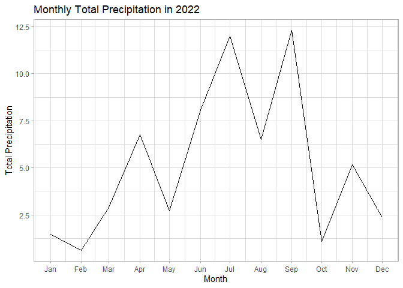

# Data Visualization Project 03


In this exercise you will explore methods to create different types of data visualizations (such as plotting text data, or exploring the distributions of continuous variables).


## PART 1: Density Plots


```r
library(lubridate)
```

```
## 
## Attaching package: 'lubridate'
```

```
## The following objects are masked from 'package:base':
## 
##     date, intersect, setdiff, union
```

```r
library(viridis)
```

```
## Loading required package: viridisLite
```

```r
library(tidyverse)
```

```
## Warning: package 'forcats' was built under R version 4.3.1
```

```
## ── Attaching core tidyverse packages ──────────────────────── tidyverse 2.0.0 ──
## ✔ dplyr   1.1.2     ✔ readr   2.1.4
## ✔ forcats 1.0.0     ✔ stringr 1.5.0
## ✔ ggplot2 3.4.2     ✔ tibble  3.2.1
## ✔ purrr   1.0.1     ✔ tidyr   1.3.0
```

```
## ── Conflicts ────────────────────────────────────────── tidyverse_conflicts() ──
## ✖ dplyr::filter() masks stats::filter()
## ✖ dplyr::lag()    masks stats::lag()
## ℹ Use the conflicted package (<http://conflicted.r-lib.org/>) to force all conflicts to become errors
```

```r
library(ggridges)
```

```
## Warning: package 'ggridges' was built under R version 4.3.1
```

Using the dataset obtained from FSU's [Florida Climate Center](https://climatecenter.fsu.edu/climate-data-access-tools/downloadable-data), for a station at Tampa International Airport (TPA) for 2022, attempt to recreate the charts shown below which were generated using data from 2016. You can read the 2022 dataset using the code below: 


```r
weather_tpa <- read_csv("https://raw.githubusercontent.com/reisanar/datasets/master/tpa_weather_2022.csv")
# random sample 
sample_n(weather_tpa, 4)
```

```
## # A tibble: 4 × 7
##    year month   day precipitation max_temp min_temp ave_temp
##   <dbl> <dbl> <dbl>         <dbl>    <dbl>    <dbl>    <dbl>
## 1  2022     6    29          0.04       94       78     86  
## 2  2022     3     2          0          78       58     68  
## 3  2022     3    26          0          81       60     70.5
## 4  2022     6    21          0          94       77     85.5
```

See https://www.reisanar.com/slides/relationships-models#10 for a reminder on how to use this type of dataset with the `lubridate` package for dates and times (example included in the slides uses data from 2016).

Using the 2022 data: 

(a) Create a plot like the one below:


```r
weather_tpa
```

```
## # A tibble: 365 × 7
##     year month   day precipitation max_temp min_temp ave_temp
##    <dbl> <dbl> <dbl>         <dbl>    <dbl>    <dbl>    <dbl>
##  1  2022     1     1       0             82       67     74.5
##  2  2022     1     2       0             82       71     76.5
##  3  2022     1     3       0.02          75       55     65  
##  4  2022     1     4       0             76       50     63  
##  5  2022     1     5       0             75       59     67  
##  6  2022     1     6       0.00001       74       56     65  
##  7  2022     1     7       0.00001       81       63     72  
##  8  2022     1     8       0             81       58     69.5
##  9  2022     1     9       0             84       65     74.5
## 10  2022     1    10       0             81       64     72.5
## # ℹ 355 more rows
```


```r
str(weather_tpa)
```

```
## spc_tbl_ [365 × 7] (S3: spec_tbl_df/tbl_df/tbl/data.frame)
##  $ year         : num [1:365] 2022 2022 2022 2022 2022 ...
##  $ month        : num [1:365] 1 1 1 1 1 1 1 1 1 1 ...
##  $ day          : num [1:365] 1 2 3 4 5 6 7 8 9 10 ...
##  $ precipitation: num [1:365] 0e+00 0e+00 2e-02 0e+00 0e+00 1e-05 1e-05 0e+00 0e+00 0e+00 ...
##  $ max_temp     : num [1:365] 82 82 75 76 75 74 81 81 84 81 ...
##  $ min_temp     : num [1:365] 67 71 55 50 59 56 63 58 65 64 ...
##  $ ave_temp     : num [1:365] 74.5 76.5 65 63 67 65 72 69.5 74.5 72.5 ...
##  - attr(*, "spec")=
##   .. cols(
##   ..   year = col_double(),
##   ..   month = col_double(),
##   ..   day = col_double(),
##   ..   precipitation = col_double(),
##   ..   max_temp = col_double(),
##   ..   min_temp = col_double(),
##   ..   ave_temp = col_double()
##   .. )
##  - attr(*, "problems")=<externalptr>
```


```r
weather_tpa_clean <- weather_tpa %>%
  mutate(doy = ymd(paste(year, month, day, sep = "-")))
weather_tpa_clean
```

```
## # A tibble: 365 × 8
##     year month   day precipitation max_temp min_temp ave_temp doy       
##    <dbl> <dbl> <dbl>         <dbl>    <dbl>    <dbl>    <dbl> <date>    
##  1  2022     1     1       0             82       67     74.5 2022-01-01
##  2  2022     1     2       0             82       71     76.5 2022-01-02
##  3  2022     1     3       0.02          75       55     65   2022-01-03
##  4  2022     1     4       0             76       50     63   2022-01-04
##  5  2022     1     5       0             75       59     67   2022-01-05
##  6  2022     1     6       0.00001       74       56     65   2022-01-06
##  7  2022     1     7       0.00001       81       63     72   2022-01-07
##  8  2022     1     8       0             81       58     69.5 2022-01-08
##  9  2022     1     9       0             84       65     74.5 2022-01-09
## 10  2022     1    10       0             81       64     72.5 2022-01-10
## # ℹ 355 more rows
```

```r
# Custom labeller function for month labels
label_month <- function(variable, value) {
  month.name[as.integer(value)]
}

ggplot(data = weather_tpa_clean) +
  geom_histogram(aes(x = max_temp, fill = as.factor(month)), binwidth = 3, color = "white", width = 0.1) +
  theme_bw() +
  scale_fill_viridis_d() +
  facet_wrap(~ month, labeller = label_month) +
  theme(legend.position = "none") +
  labs(x = "Maximum Temperatures", y = "Number of Days")
```

```
## Warning: The `labeller` API has been updated. Labellers taking `variable` and `value`
## arguments are now deprecated.
## ℹ See labellers documentation.
```

<!-- -->

Hint: the option `binwidth = 3` was used with the `geom_histogram()` function.

(b) Create a plot like the one below:


Hint: check the `kernel` parameter of the `geom_density()` function, and use `bw = 0.5`.


```r
ggplot(weather_tpa_clean) +
  geom_density(aes(max_temp),
               bw = 0.5, 
               kernel = "epanechnikov",
               color = "gray3", 
               fill="grey50", 
               size = 1) +
  theme_minimal() +
  labs(x = "Maximum Temperature")
```

```
## Warning: Using `size` aesthetic for lines was deprecated in ggplot2 3.4.0.
## ℹ Please use `linewidth` instead.
## This warning is displayed once every 8 hours.
## Call `lifecycle::last_lifecycle_warnings()` to see where this warning was
## generated.
```

<!-- -->


(c) Create a plot like the one below:


Hint: default options for `geom_density()` were used. 


```r
weather_tpa_clean %>%
  ggplot(mapping = aes(x = max_temp, fill = month)) +
  geom_density(color = "black", size=1) +
  facet_wrap(~ month, labeller = label_month) +
  theme_bw() +
  labs(x = "Maximum temperatures", title = "Density plots for each month in 2022") +
  scale_fill_viridis() +
  theme(legend.position = "none")
```

```
## Warning: The `labeller` API has been updated. Labellers taking `variable` and `value`
## arguments are now deprecated.
## ℹ See labellers documentation.
```

<!-- -->


(d) Generate a plot like the chart below:


Hint: use the`{ggridges}` package, and the `geom_density_ridges()` function paying close attention to the `quantile_lines` and `quantiles` parameters. The plot above uses the `plasma` option (color scale) for the _viridis_ palette.


```r
library(forcats)

# Create a custom factor with ordered months
# weather_tpa_clean$month <- factor(weather_tpa_clean$month, levels = 1:12, labels = month.name)

ggplot(weather_tpa_clean, aes(x = max_temp, y = fct_reorder(month.name[month], month), fill = stat(x))) +
  geom_density_ridges_gradient(scale = 1.5, quantile_lines = TRUE, quantiles = 2, color = "black", size = 1) +
  scale_fill_viridis(option = "plasma") +
  labs(x = "Maximum Temperature(in Fahrenheit degress)", y = NULL) +
  theme_ridges() +
  theme(legend.title=element_blank(), 
        axis.title.x = element_text(hjust = 0)) 
```

```
## Warning: `stat(x)` was deprecated in ggplot2 3.4.0.
## ℹ Please use `after_stat(x)` instead.
## This warning is displayed once every 8 hours.
## Call `lifecycle::last_lifecycle_warnings()` to see where this warning was
## generated.
```

```
## Picking joint bandwidth of 1.93
```

```
## Warning: Using the `size` aesthetic with geom_segment was deprecated in ggplot2 3.4.0.
## ℹ Please use the `linewidth` aesthetic instead.
## This warning is displayed once every 8 hours.
## Call `lifecycle::last_lifecycle_warnings()` to see where this warning was
## generated.
```

<!-- -->


(e) Create a plot of your choice that uses the attribute for precipitation _(values of -99.9 for temperature or -99.99 for precipitation represent missing data)_.


```r
# Filter out the missing data
weather_tpa_clean <- weather_tpa_clean %>% filter(precipitation != -99.99) %>% 
  mutate(fdom = ymd(format(weather_tpa_clean$doy, "%Y-%m-01")) )


# Calculate the monthly precipitation
monthly_precipitation <- weather_tpa_clean %>% group_by(fdom) %>% summarize(precipitation = sum(precipitation))

summary(weather_tpa_clean %>% filter(precipitation>0))
```

```
##       year          month            day        precipitation    
##  Min.   :2022   Min.   : 1.00   Min.   : 1.00   Min.   :0.00001  
##  1st Qu.:2022   1st Qu.: 5.00   1st Qu.: 8.00   1st Qu.:0.01000  
##  Median :2022   Median : 7.50   Median :15.00   Median :0.08500  
##  Mean   :2022   Mean   : 7.16   Mean   :15.39   Mean   :0.43021  
##  3rd Qu.:2022   3rd Qu.: 9.00   3rd Qu.:23.00   3rd Qu.:0.64750  
##  Max.   :2022   Max.   :12.00   Max.   :31.00   Max.   :2.86000  
##     max_temp        min_temp        ave_temp          doy            
##  Min.   :56.00   Min.   :42.00   Min.   :51.50   Min.   :2022-01-03  
##  1st Qu.:80.75   1st Qu.:67.00   1st Qu.:74.00   1st Qu.:2022-05-28  
##  Median :88.00   Median :74.00   Median :81.50   Median :2022-07-29  
##  Mean   :85.40   Mean   :70.83   Mean   :78.11   Mean   :2022-07-20  
##  3rd Qu.:93.00   3rd Qu.:77.00   3rd Qu.:85.00   3rd Qu.:2022-09-23  
##  Max.   :96.00   Max.   :83.00   Max.   :88.50   Max.   :2022-12-31  
##       fdom           
##  Min.   :2022-01-01  
##  1st Qu.:2022-05-01  
##  Median :2022-07-16  
##  Mean   :2022-07-06  
##  3rd Qu.:2022-09-01  
##  Max.   :2022-12-01
```

```r
# Create a line plot
library(scales)
```

```
## Warning: package 'scales' was built under R version 4.3.1
```

```
## 
## Attaching package: 'scales'
```

```
## The following object is masked from 'package:purrr':
## 
##     discard
```

```
## The following object is masked from 'package:readr':
## 
##     col_factor
```

```
## The following object is masked from 'package:viridis':
## 
##     viridis_pal
```

```r
ggplot(monthly_precipitation, aes(x = fdom, y = precipitation)) +
  geom_line() +
  scale_x_date(labels = date_format("%b"), breaks = seq(min(monthly_precipitation$fdom), max(monthly_precipitation$fdom), by = "month"))+
  labs(x = "Month", y = "Total Precipitation", title = "Monthly Total Precipitation in 2022") +
  theme_light()
```

<!-- -->


```r
ggplot(monthly_precipitation, aes(x = fdom, y = precipitation)) +
  geom_bar(stat = "identity", fill = "royalblue4") +
  labs(x = "Month", y = "Total Precipitation", title ="Distribution of monthly Total Precipitation in 2022") +
  scale_x_date(labels = date_format("%b"), breaks = seq(min(monthly_precipitation$fdom), max(monthly_precipitation$fdom), by = "month")) +
  theme_minimal() 
```

<!-- -->

Based on the line chart and bar plot depicting the total monthly precipitation for the year 2022, we can observe the distribution of precipitation across different months. **September** exhibits the highest precipitation, followed by **July**. These visualizations provide insights into the varying levels of precipitation throughout the year.


## PART 2 

> **You can choose to work on either Option (A) or Option (B)**. Remove from this template the option you decided not to work on. 


### Option (A): Visualizing Text Data

Review the set of slides (and additional resources linked in it) for visualizing text data: https://www.reisanar.com/slides/text-viz#1

Choose any dataset with text data, and create at least one visualization with it. For example, you can create a frequency count of most used bigrams, a sentiment analysis of the text data, a network visualization of terms commonly used together, and/or a visualization of a topic modeling approach to the problem of identifying words/documents associated to different topics in the text data you decide to use. 

Make sure to include a copy of the dataset in the `data/` folder, and reference your sources if different from the ones listed below:

- [Billboard Top 100 Lyrics](https://github.com/reisanar/datasets/blob/master/BB_top100_2015.csv)

- [RateMyProfessors comments](https://github.com/reisanar/datasets/blob/master/rmp_wit_comments.csv)

- [FL Poly News Articles](https://github.com/reisanar/datasets/blob/master/flpoly_news_SP23.csv)


(to get the "raw" data from any of the links listed above, simply click on the `raw` button of the GitHub page and copy the URL to be able to read it in your computer using the `read_csv()` function)


### Option (B): Data on Concrete Strength 

Concrete is the most important material in **civil engineering**. The concrete compressive strength is a highly nonlinear function of _age_ and _ingredients_. The dataset used here is from the [UCI Machine Learning Repository](https://archive.ics.uci.edu/ml/index.php), and it contains 1030 observations with 9 different attributes 9 (8 quantitative input variables, and 1 quantitative output variable). A data dictionary is included below: 


Variable                      |    Notes                
------------------------------|-------------------------------------------
Cement                        | kg in a $m^3$ mixture             
Blast Furnace Slag            | kg in a $m^3$ mixture  
Fly Ash                       | kg in a $m^3$ mixture             
Water                         | kg in a $m^3$ mixture              
Superplasticizer              | kg in a $m^3$ mixture
Coarse Aggregate              | kg in a $m^3$ mixture
Fine Aggregate                | kg in a $m^3$ mixture      
Age                           | in days                                             
Concrete compressive strength | MPa, megapascals


Below we read the `.csv` file using `readr::read_csv()` (the `readr` package is part of the `tidyverse`)


```r
concrete <- read_csv("../data/concrete.csv", show_col_types=FALSE)
# concrete$Age = as.factor(concrete$Age) 
summary(concrete)
```

```
##      Cement      Blast_Furnace_Slag    Fly_Ash           Water      
##  Min.   :102.0   Min.   :  0.0      Min.   :  0.00   Min.   :121.8  
##  1st Qu.:192.4   1st Qu.:  0.0      1st Qu.:  0.00   1st Qu.:164.9  
##  Median :272.9   Median : 22.0      Median :  0.00   Median :185.0  
##  Mean   :281.2   Mean   : 73.9      Mean   : 54.19   Mean   :181.6  
##  3rd Qu.:350.0   3rd Qu.:142.9      3rd Qu.:118.27   3rd Qu.:192.0  
##  Max.   :540.0   Max.   :359.4      Max.   :200.10   Max.   :247.0  
##  Superplasticizer Coarse_Aggregate Fine_Aggregate       Age        
##  Min.   : 0.000   Min.   : 801.0   Min.   :594.0   Min.   :  1.00  
##  1st Qu.: 0.000   1st Qu.: 932.0   1st Qu.:731.0   1st Qu.:  7.00  
##  Median : 6.350   Median : 968.0   Median :779.5   Median : 28.00  
##  Mean   : 6.203   Mean   : 972.9   Mean   :773.6   Mean   : 45.66  
##  3rd Qu.:10.160   3rd Qu.:1029.4   3rd Qu.:824.0   3rd Qu.: 56.00  
##  Max.   :32.200   Max.   :1145.0   Max.   :992.6   Max.   :365.00  
##  Concrete_compressive_strength
##  Min.   : 2.332               
##  1st Qu.:23.707               
##  Median :34.443               
##  Mean   :35.818               
##  3rd Qu.:46.136               
##  Max.   :82.599
```


Let us create a new attribute for visualization purposes, `strength_range`: 


```r
new_concrete <- concrete %>%
  mutate(strength_range = cut(Concrete_compressive_strength, 
                              breaks = quantile(Concrete_compressive_strength, 
                                                probs = seq(0, 1, 0.2))) )
```


1. Explore the distribution of 2 of the continuous variables available in the dataset. Do ranges make sense? Comment on your findings.


```r
print('Summary Statistics for variable Cement:')
```

```
## [1] "Summary Statistics for variable Cement:"
```

```r
summary(new_concrete$Cement)
```

```
##    Min. 1st Qu.  Median    Mean 3rd Qu.    Max. 
##   102.0   192.4   272.9   281.2   350.0   540.0
```

```r
ggplot(new_concrete, aes(x=Cement)) +
    geom_density(alpha=.2, fill="#FF6666")+
  ggtitle('Distribution of Cement variable')
```

<!-- -->
Concrete in Kgs cant be negative. DIstribution makes sense with the range between 102 and 540 Kg, and a mean of 281.2 Kg

```r
print('Summary Statistics for variable Coarse_Aggregate:')
```

```
## [1] "Summary Statistics for variable Coarse_Aggregate:"
```

```r
summary(new_concrete$Coarse_Aggregate)
```

```
##    Min. 1st Qu.  Median    Mean 3rd Qu.    Max. 
##   801.0   932.0   968.0   972.9  1029.4  1145.0
```

```r
ggplot(new_concrete, aes(x=Coarse_Aggregate)) +
    geom_density(alpha=.2, fill="#FF6666")+
  ggtitle('Distribution of Coarse_Aggregate variable')
```

<!-- -->
Coarse Aggregate in Kgs cant be negative. Distribution makes sense with the range between 801 and 1145 Kg, and a mean of 972.9 Kg

2. Use a _temporal_ indicator such as the one available in the variable `Age` (measured in days). Generate a plot similar to the one shown below. Comment on your results.


We could observe horizontal patterns for each color, which shows there are multiple segments in the data. This shows specific combination of materials create a certain compressive strength. And changing that mixture combination can change the compressive strength.

3. Create a scatterplot similar to the one shown below. Pay special attention to which variables are being mapped to specific aesthetics of the plot. Comment on your results. 


This shows that at higher level as Cement content increases Strength increases. Most of the purple  dots are at the top with higher strength, which shows that optimal water content generates higher compressive strength. Most of the smaller dots are at the bottom, which shows less the age less the strength. 
However, these trends are not completely generalized. To better understood or explain the variance in compressive strength we would have to explore its relationship with other variables in the dataset.


